# `frontend/src/routes/admin` 클래스 다이어그램

**대상 경로:** `frontend/src/routes/admin`

## 책임
`frontend/src/routes/admin`의 책임은 <<interface>>, <<type alias>>으로 표현되는 운영 타입 계약을 정의하는 것이다.
이 문서는 13개 source type과 0개 정적 관계를 1개 Mermaid class diagram으로 나누어 보여준다.

## 포함 파일
- `frontend/src/routes/admin/+page.svelte`
- `frontend/src/routes/admin/containers/+page.svelte`
- `frontend/src/routes/admin/drover/+page.svelte`
- `frontend/src/routes/admin/instances/+page.svelte`
- `frontend/src/routes/admin/object-storage/+page.svelte`
- `frontend/src/routes/admin/orphans/+page.svelte`
- `frontend/src/routes/admin/roles/+page.svelte`
- `frontend/src/routes/admin/secrets/+page.svelte`
- `frontend/src/routes/admin/system-admins/+page.svelte`
- `frontend/src/routes/admin/users/+page.svelte`

## 다이어그램 1 — `frontend/src/routes/admin/+page.svelte::IdentitySummary` … `frontend/src/routes/admin/users/+page.svelte::ActivityEvent`

```mermaid
classDiagram
%% source-type: frontend/src/routes/admin/+page.svelte::IdentitySummary
class T_frontend_src_routes_admin_page_svelte_IdentitySummary_8392c5616f7d["IdentitySummary (frontend/src/routes/admin/+page.svelte)"] {
  <<interface>>
  +user_count: number
  +project_count: number
  +role_count: number
  +group_count: number
  +partial: boolean | undefined
  +partial_reasons: Array~string~ | undefined
  +recent_users: Array~object~ | undefined
  +recent_projects: Array~object~ | undefined
}
%% source-type: frontend/src/routes/admin/+page.svelte::Notification
class T_frontend_src_routes_admin_page_svelte_Notification_df8af59a1f14["Notification (frontend/src/routes/admin/+page.svelte)"] {
  <<interface>>
  +severity: string
  +message: string
  +target: string
  +href: string
}
%% source-type: frontend/src/routes/admin/containers/+page.svelte::AdminContainer
class T_frontend_src_routes_admin_containers_page_svelte_AdminContainer_db8b78e9c3ba["AdminContainer (frontend/src/routes/admin/containers/+page.svelte)"] {
  <<interface>>
  +uuid: string
  +name: string
  +status: string
  +image: string | null
  +cpu: number | null
  +memory: string | null
  +host: string | null
  +created_at: string | null
  +project_id: string | null
}
%% source-type: frontend/src/routes/admin/drover/+page.svelte::AdminK3sCluster
class T_frontend_src_routes_admin_drover_page_svelte_AdminK3sCluster_072e279590e7["AdminK3sCluster (frontend/src/routes/admin/drover/+page.svelte)"] {
  <<interface>>
  +id: string
  +name: string
  +status: string
  +status_reason: string | null
  +server_ip: string | null
  +api_address: string | null
  +agent_count: number
  +agent_vm_ids: Array~string~
  +k3s_version: string | null
  +created_at: string | null
  +project_id: string | null
}
%% source-type: frontend/src/routes/admin/instances/+page.svelte::InstanceHealth
class T_frontend_src_routes_admin_instances_page_svelte_InstanceHealth_6e131ad111ac["InstanceHealth (frontend/src/routes/admin/instances/+page.svelte)"] {
  <<interface>>
  +total: number
  +active: number
  +error: number
  +with_alerts: number
  +gpu_count: number
}
%% source-type: frontend/src/routes/admin/object-storage/+page.svelte::AccountMeta
class T_frontend_src_routes_admin_object_storage_page_svelte_AccountMeta_ef610993eecc["AccountMeta (frontend/src/routes/admin/object-storage/+page.svelte)"] {
  <<interface>>
  +container_count: number
  +object_count: number
  +bytes_used: number
}
%% source-type: frontend/src/routes/admin/orphans/+page.svelte::Kind
class T_frontend_src_routes_admin_orphans_page_svelte_Kind_bfecef09a4ce["Kind (frontend/src/routes/admin/orphans/+page.svelte)"] {
  <<type alias>>
  +value: OrphanKind
}
%% source-type: frontend/src/routes/admin/roles/+page.svelte::Role
class T_frontend_src_routes_admin_roles_page_svelte_Role_874a9179f2d0["Role (frontend/src/routes/admin/roles/+page.svelte)"] {
  <<interface>>
  +id: string
  +name: string
  +domain_id: string | null
}
%% source-type: frontend/src/routes/admin/secrets/+page.svelte::FieldEntry
class T_frontend_src_routes_admin_secrets_page_svelte_FieldEntry_18a44796ca55["FieldEntry (frontend/src/routes/admin/secrets/+page.svelte)"] {
  <<type alias>>
  +value: tuple~string; number | null; Callable~v: number | null; returns void~~
}
%% source-type: frontend/src/routes/admin/secrets/+page.svelte::ProjectQuota
class T_frontend_src_routes_admin_secrets_page_svelte_ProjectQuota_5fdec021b8f9["ProjectQuota (frontend/src/routes/admin/secrets/+page.svelte)"] {
  <<interface>>
  +project_id: string
  +project_quotas: object
}
%% source-type: frontend/src/routes/admin/system-admins/+page.svelte::SecurityPolicy
class T_frontend_src_routes_admin_system_admins_page_svelte_SecurityPolicy_7f1fb41bbbc2["SecurityPolicy (frontend/src/routes/admin/system-admins/+page.svelte)"] {
  <<interface>>
  +legacy_compat: boolean
  +system_admin_count: number
  +admin_project_member_count: number
}
%% source-type: frontend/src/routes/admin/system-admins/+page.svelte::SystemAdmin
class T_frontend_src_routes_admin_system_admins_page_svelte_SystemAdmin_b3cd19415f40["SystemAdmin (frontend/src/routes/admin/system-admins/+page.svelte)"] {
  <<interface>>
  +user_id: string
  +name: string
  +email: string
  +enabled: boolean
}
%% source-type: frontend/src/routes/admin/users/+page.svelte::ActivityEvent
class T_frontend_src_routes_admin_users_page_svelte_ActivityEvent_18ae0bc72454["ActivityEvent (frontend/src/routes/admin/users/+page.svelte)"] {
  <<interface>>
  +id: number
  +created_at: string
  +username: string
  +action: string
  +resource_name: string | null
  +status: string
}
```

### 관계 설명
- 없음

### 타입 표기 정규화
| Mermaid 표기 | 소스 표기 |
|---|---|
| `Array~string~` | `string[]` |
| `Array~object~` | `{ id: string; name: string }[]` |
| `tuple~string; number | null; Callable~v: number | null; returns void~~` | `[string, number | null, (v: number | null) => void]` |
| `object` | `{ secrets?: number; orders?: number; containers?: number; consumers?: number; cas?: number; }` |
