# `frontend/src/routes/admin/libraries` 클래스 다이어그램

**대상 경로:** `frontend/src/routes/admin/libraries`

## 책임
`frontend/src/routes/admin/libraries`의 책임은 <<interface>>으로 표현되는 운영 타입 계약을 정의하는 것이다.
이 문서는 10개 source type과 5개 정적 관계를 1개 Mermaid class diagram으로 나누어 보여준다.

## 포함 파일
- `frontend/src/routes/admin/libraries/+page.svelte`

## 다이어그램 1 — `frontend/src/routes/admin/libraries/+page.svelte::ArtifactSummary` … `frontend/src/routes/admin/libraries/+page.svelte::LayerProfile`

```mermaid
classDiagram
%% source-type: frontend/src/routes/admin/libraries/+page.svelte::ArtifactSummary
class T_frontend_src_routes_admin_libraries_page_svelte_ArtifactSummary_d09619aadad8["ArtifactSummary (frontend/src/routes/admin/libraries/+page.svelte)"] {
  <<interface>>
  +id: number
  +name: string
  +kind: string
  +python_version: string | null
  +parent_id: number | null
  +is_sealed: boolean
  +is_published: boolean
  +pip_packages: Array~string~
  +apt_packages: Array~string~
  +ubuntu_base: string
  +base_image_id: string | null | undefined
  +base_image_name: string | null | undefined
}
%% source-type: frontend/src/routes/admin/libraries/+page.svelte::DeleteBlocker
class T_frontend_src_routes_admin_libraries_page_svelte_DeleteBlocker_6e3ac01ccb60["DeleteBlocker (frontend/src/routes/admin/libraries/+page.svelte)"] {
  <<interface>>
  +type: string
  +message: string
  +items: Array~Record~string; unknown~~
}
%% source-type: frontend/src/routes/admin/libraries/+page.svelte::LayerArtifact
class T_frontend_src_routes_admin_libraries_page_svelte_LayerArtifact_4c056c6219ea["LayerArtifact (frontend/src/routes/admin/libraries/+page.svelte)"] {
  <<interface>>
  +id: number
  +name: string
  +kind: string
  +python_version: string | null
  +sqsh_filename: string
  +parent_id: number | null
  +is_sealed: boolean
  +base_image_id: string | null | undefined
  +lineage: Array~ArtifactSummary~
  +ancestors: Array~ArtifactSummary~
  +direct_children: Array~ArtifactSummary~
  +delete_blockers: Array~DeleteBlocker~
}
%% source-type: frontend/src/routes/admin/libraries/+page.svelte::LayerBaseImage
class T_frontend_src_routes_admin_libraries_page_svelte_LayerBaseImage_ddc87361f05f["LayerBaseImage (frontend/src/routes/admin/libraries/+page.svelte)"] {
  <<interface>>
  +id: string
  +name: string
  +status: string
  +ubuntu_base: string
  +size: number
  +min_disk: number
  +min_ram: number
  +disk_format: string
  +visibility: string
  +owner: string
  +checksum: string | null
  +os_hash_algo: string | null
}
%% source-type: frontend/src/routes/admin/libraries/+page.svelte::LayerBuild
class T_frontend_src_routes_admin_libraries_page_svelte_LayerBuild_5cf12484a750["LayerBuild (frontend/src/routes/admin/libraries/+page.svelte)"] {
  <<interface>>
  +id: number
  +layer_name: string
  +kind: string
  +python_version: string | null
  +share_id: string
  +server_id: string | null
  +port_id: string | null
  +build_token: string | null
  +cloud_init_status: string | null
  +status: string
  +base_image_id: string | null | undefined
  +parent_artifact_id: number | null | undefined
}
%% source-type: frontend/src/routes/admin/libraries/+page.svelte::LayerBuildDetail
class T_frontend_src_routes_admin_libraries_page_svelte_LayerBuildDetail_8441612dc9f2["LayerBuildDetail (frontend/src/routes/admin/libraries/+page.svelte)"] {
  <<interface>>
  +vm_status: string | null | undefined
  +vm_ip: string | null | undefined
  +live_console: string | null | undefined
}
%% source-type: frontend/src/routes/admin/libraries/+page.svelte::LayerConsume
class T_frontend_src_routes_admin_libraries_page_svelte_LayerConsume_5f62a94a0ad7["LayerConsume (frontend/src/routes/admin/libraries/+page.svelte)"] {
  <<interface>>
  +id: number
  +profile_name: string
  +server_id: string | null
  +port_id: string | null
  +server_name: string | null
  +share_id: string
  +status: string
  +error_message: string | null
  +created_at: string | null
  +completed_at: string | null
  +vm_status: string | null | undefined
  +vm_ip: string | null | undefined
}
%% source-type: frontend/src/routes/admin/libraries/+page.svelte::LayerDeletePreview
class T_frontend_src_routes_admin_libraries_page_svelte_LayerDeletePreview_aab7708f9a51["LayerDeletePreview (frontend/src/routes/admin/libraries/+page.svelte)"] {
  <<interface>>
  +artifact: ArtifactSummary
  +lineage: Array~ArtifactSummary~
  +direct_children: Array~ArtifactSummary~
  +child_count: number
  +profile_references: Array~object~
  +active_consume_references: Array~object~
  +active_build_references: Array~object~
  +delete_blockers: Array~DeleteBlocker~
  +can_delete: boolean
}
%% source-type: frontend/src/routes/admin/libraries/+page.svelte::LayerImportJob
class T_frontend_src_routes_admin_libraries_page_svelte_LayerImportJob_51696e7698ac["LayerImportJob (frontend/src/routes/admin/libraries/+page.svelte)"] {
  <<interface>>
  +id: number
  +status: string
  +progress_step: string | null
  +progress_pct: number
  +error_message: string | null
  +github_url: string
  +commit_sha: string
  +dockerfile_path: string
  +layer_prefix: string
  +profile_name: string
  +ubuntu_base: string
  +base_image_id: string
}
%% source-type: frontend/src/routes/admin/libraries/+page.svelte::LayerProfile
class T_frontend_src_routes_admin_libraries_page_svelte_LayerProfile_3427bad58582["LayerProfile (frontend/src/routes/admin/libraries/+page.svelte)"] {
  <<interface>>
  +id: number
  +name: string
  +layers: Array~string~
  +is_published: boolean
  +created_at: string | null
  +updated_at: string | null
}
T_frontend_src_routes_admin_libraries_page_svelte_LayerArtifact_4c056c6219ea --> T_frontend_src_routes_admin_libraries_page_svelte_ArtifactSummary_d09619aadad8 : associates
T_frontend_src_routes_admin_libraries_page_svelte_LayerDeletePreview_aab7708f9a51 --> T_frontend_src_routes_admin_libraries_page_svelte_ArtifactSummary_d09619aadad8 : associates
T_frontend_src_routes_admin_libraries_page_svelte_LayerArtifact_4c056c6219ea --> T_frontend_src_routes_admin_libraries_page_svelte_DeleteBlocker_6e3ac01ccb60 : associates
T_frontend_src_routes_admin_libraries_page_svelte_LayerDeletePreview_aab7708f9a51 --> T_frontend_src_routes_admin_libraries_page_svelte_DeleteBlocker_6e3ac01ccb60 : associates
T_frontend_src_routes_admin_libraries_page_svelte_LayerBuild_5cf12484a750 <|-- T_frontend_src_routes_admin_libraries_page_svelte_LayerBuildDetail_8441612dc9f2 : inherits
```

### 관계 설명
- `frontend/src/routes/admin/libraries/+page.svelte::LayerArtifact --> frontend/src/routes/admin/libraries/+page.svelte::ArtifactSummary` — 근거: `frontend/src/routes/admin/libraries/+page.svelte::LayerArtifact.ancestors`, `frontend/src/routes/admin/libraries/+page.svelte::LayerArtifact.direct_children`, `frontend/src/routes/admin/libraries/+page.svelte::LayerArtifact.lineage`; 관계: `associates`.
- `frontend/src/routes/admin/libraries/+page.svelte::LayerDeletePreview --> frontend/src/routes/admin/libraries/+page.svelte::ArtifactSummary` — 근거: `frontend/src/routes/admin/libraries/+page.svelte::LayerDeletePreview.artifact`, `frontend/src/routes/admin/libraries/+page.svelte::LayerDeletePreview.direct_children`, `frontend/src/routes/admin/libraries/+page.svelte::LayerDeletePreview.lineage`; 관계: `associates`.
- `frontend/src/routes/admin/libraries/+page.svelte::LayerArtifact --> frontend/src/routes/admin/libraries/+page.svelte::DeleteBlocker` — 근거: `frontend/src/routes/admin/libraries/+page.svelte::LayerArtifact.delete_blockers`; 관계: `associates`.
- `frontend/src/routes/admin/libraries/+page.svelte::LayerDeletePreview --> frontend/src/routes/admin/libraries/+page.svelte::DeleteBlocker` — 근거: `frontend/src/routes/admin/libraries/+page.svelte::LayerDeletePreview.delete_blockers`; 관계: `associates`.
- `frontend/src/routes/admin/libraries/+page.svelte::LayerBuild <|-- frontend/src/routes/admin/libraries/+page.svelte::LayerBuildDetail` — 근거: `frontend/src/routes/admin/libraries/+page.svelte::LayerBuildDetail.__bases__`; 관계: `inherits`.

### 타입 표기 정규화
| Mermaid 표기 | 소스 표기 |
|---|---|
| `Array~string~` | `string[]` |
| `Array~Record~string; unknown~~` | `Record<string, unknown>[]` |
| `Array~ArtifactSummary~` | `ArtifactSummary[]` |
| `Array~object~` | `{ id: number; name: string; layers: string[] }[]` |
| `Array~object~` | `{ id: number; profile_name: string; status: string; server_id?: string | null }[]` |
| `Array~object~` | `{ id: number; layer_name: string; status: string }[]` |
| `Array~DeleteBlocker~` | `DeleteBlocker[]` |
| `Array~object~` | `{ name: string; line: number; instruction: string }[]` |
| `Array~number~` | `number[]` |
