# `frontend/src/routes/dashboard` 클래스 다이어그램

**대상 경로:** `frontend/src/routes/dashboard`

## 책임
`frontend/src/routes/dashboard`의 책임은 <<interface>>, <<type alias>>으로 표현되는 운영 타입 계약을 정의하는 것이다.
이 문서는 9개 source type과 2개 정적 관계를 1개 Mermaid class diagram으로 나누어 보여준다.

## 포함 파일
- `frontend/src/routes/dashboard/+page.svelte`
- `frontend/src/routes/dashboard/containers/clusters/[id]/+page.svelte`
- `frontend/src/routes/dashboard/file-storage/security-services/+page.svelte`
- `frontend/src/routes/dashboard/library/create/+page.svelte`
- `frontend/src/routes/dashboard/secrets/+page.svelte`
- `frontend/src/routes/dashboard/usage-report/+page.svelte`

## 다이어그램 1 — `frontend/src/routes/dashboard/+page.svelte::Notification` … `frontend/src/routes/dashboard/usage-report/+page.svelte::UsageReport`

```mermaid
classDiagram
%% source-type: frontend/src/routes/dashboard/+page.svelte::Notification
class T_frontend_src_routes_dashboard_page_svelte_Notification_0a78a3e9ff9b["Notification (frontend/src/routes/dashboard/+page.svelte)"] {
  <<interface>>
  +type: string
  +severity: string
  +message: string
  +count: number
}
%% source-type: frontend/src/routes/dashboard/+page.svelte::TrendData
class T_frontend_src_routes_dashboard_page_svelte_TrendData_615106e58416["TrendData (frontend/src/routes/dashboard/+page.svelte)"] {
  <<interface>>
  +vcpu: TrendSeries
  +memory: TrendSeries
  +storage: TrendSeries
  +network: TrendSeries & object
  +prometheus_available: boolean
  +range: '24h' | '7d' | '14d'
}
%% source-type: frontend/src/routes/dashboard/+page.svelte::TrendSeries
class T_frontend_src_routes_dashboard_page_svelte_TrendSeries_8ef23d005874["TrendSeries (frontend/src/routes/dashboard/+page.svelte)"] {
  <<interface>>
  +data: Array~number~
  +points: number
  +available: boolean
}
%% source-type: frontend/src/routes/dashboard/containers/clusters/[id]/+page.svelte::Tab
class T_frontend_src_routes_dashboard_containers_clusters_id_page_svelte_Tab_6bbddce6af9b["Tab (frontend/src/routes/dashboard/containers/clusters/[id]/+page.svelte)"] {
  <<type alias>>
  +value: 'detail' | 'resources' | 'events'
}
%% source-type: frontend/src/routes/dashboard/file-storage/security-services/+page.svelte::CreateForm
class T_frontend_src_routes_dashboard_file_storage_security_services_page_svelte_CreateForm_0bb14643d453["CreateForm (frontend/src/routes/dashboard/file-storage/security-services/+page.svelte)"] {
  <<type alias>>
  +type: string
  +name: string
  +description: string
  +dns_ip: string
  +server: string
  +domain: string
  +user: string
  +password: string
}
%% source-type: frontend/src/routes/dashboard/library/create/+page.svelte::LayerInfo
class T_frontend_src_routes_dashboard_library_create_page_svelte_LayerInfo_1081ee847de5["LayerInfo (frontend/src/routes/dashboard/library/create/+page.svelte)"] {
  <<interface>>
  +id: string
  +name: string
  +version: string
  +sealed: boolean
}
%% source-type: frontend/src/routes/dashboard/secrets/+page.svelte::Tab
class T_frontend_src_routes_dashboard_secrets_page_svelte_Tab_a640c3ef3301["Tab (frontend/src/routes/dashboard/secrets/+page.svelte)"] {
  <<type alias>>
  +value: 'secrets' | 'containers' | 'orders' | 'quota'
}
%% source-type: frontend/src/routes/dashboard/usage-report/+page.svelte::FlavorHour
class T_frontend_src_routes_dashboard_usage_report_page_svelte_FlavorHour_e5de7a85116a["FlavorHour (frontend/src/routes/dashboard/usage-report/+page.svelte)"] {
  <<interface>>
  +flavor: string
  +instance_count: number
  +usage_hours: number
}
%% source-type: frontend/src/routes/dashboard/usage-report/+page.svelte::UsageReport
class T_frontend_src_routes_dashboard_usage_report_page_svelte_UsageReport_9cb3af297315["UsageReport (frontend/src/routes/dashboard/usage-report/+page.svelte)"] {
  <<interface>>
  +range: string
  +start: string
  +end: string
  +stats: object
  +flavor_hours: Array~FlavorHour~
  +forecast: object
}
T_frontend_src_routes_dashboard_page_svelte_TrendData_615106e58416 --> T_frontend_src_routes_dashboard_page_svelte_TrendSeries_8ef23d005874 : associates
T_frontend_src_routes_dashboard_usage_report_page_svelte_UsageReport_9cb3af297315 --> T_frontend_src_routes_dashboard_usage_report_page_svelte_FlavorHour_e5de7a85116a : associates
```

### 관계 설명
- `frontend/src/routes/dashboard/+page.svelte::TrendData --> frontend/src/routes/dashboard/+page.svelte::TrendSeries` — 근거: `frontend/src/routes/dashboard/+page.svelte::TrendData.memory`, `frontend/src/routes/dashboard/+page.svelte::TrendData.network`, `frontend/src/routes/dashboard/+page.svelte::TrendData.storage`, `frontend/src/routes/dashboard/+page.svelte::TrendData.vcpu`; 관계: `associates`.
- `frontend/src/routes/dashboard/usage-report/+page.svelte::UsageReport --> frontend/src/routes/dashboard/usage-report/+page.svelte::FlavorHour` — 근거: `frontend/src/routes/dashboard/usage-report/+page.svelte::UsageReport.flavor_hours`; 관계: `associates`.

### 타입 표기 정규화
| Mermaid 표기 | 소스 표기 |
|---|---|
| `TrendSeries & object` | `TrendSeries & { unit: string }` |
| `Array~number~` | `number[]` |
| `object` | `{ instance_hours: number; vcpu_hours: number; active_instances: number; total_instances: number; }` |
| `Array~FlavorHour~` | `FlavorHour[]` |
| `object` | `{ vcpu_pct: number; }` |
