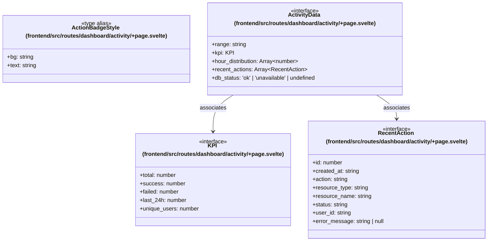

# `frontend/src/routes/dashboard/activity` 클래스 다이어그램

**대상 경로:** `frontend/src/routes/dashboard/activity`

## 책임
`frontend/src/routes/dashboard/activity`의 책임은 <<interface>>, <<type alias>>으로 표현되는 운영 타입 계약을 정의하는 것이다.
이 문서는 4개 source type과 2개 정적 관계를 1개 Mermaid class diagram으로 나누어 보여준다.

## 포함 파일
- `frontend/src/routes/dashboard/activity/+page.svelte`

## 다이어그램 1 — `frontend/src/routes/dashboard/activity/+page.svelte::ActionBadgeStyle` … `frontend/src/routes/dashboard/activity/+page.svelte::RecentAction`

### 관계 설명
- `frontend/src/routes/dashboard/activity/+page.svelte::ActivityData --> frontend/src/routes/dashboard/activity/+page.svelte::KPI` — 근거: `frontend/src/routes/dashboard/activity/+page.svelte::ActivityData.kpi`; 관계: `associates`.
- `frontend/src/routes/dashboard/activity/+page.svelte::ActivityData --> frontend/src/routes/dashboard/activity/+page.svelte::RecentAction` — 근거: `frontend/src/routes/dashboard/activity/+page.svelte::ActivityData.recent_actions`; 관계: `associates`.

### 타입 표기 정규화
| Mermaid 표기 | 소스 표기 |
|---|---|
| `Array~number~` | `number[]` |
| `Array~RecentAction~` | `RecentAction[]` |
