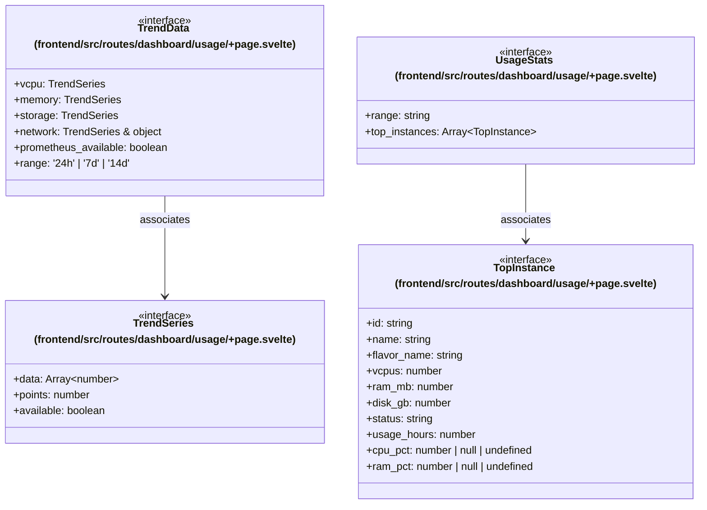

# `frontend/src/routes/dashboard/usage` 클래스 다이어그램

**대상 경로:** `frontend/src/routes/dashboard/usage`

## 책임
`frontend/src/routes/dashboard/usage`의 책임은 <<interface>>으로 표현되는 운영 타입 계약을 정의하는 것이다.
이 문서는 4개 source type과 2개 정적 관계를 1개 Mermaid class diagram으로 나누어 보여준다.

## 포함 파일
- `frontend/src/routes/dashboard/usage/+page.svelte`

## 다이어그램 1 — `frontend/src/routes/dashboard/usage/+page.svelte::TopInstance` … `frontend/src/routes/dashboard/usage/+page.svelte::UsageStats`

### 관계 설명
- `frontend/src/routes/dashboard/usage/+page.svelte::UsageStats --> frontend/src/routes/dashboard/usage/+page.svelte::TopInstance` — 근거: `frontend/src/routes/dashboard/usage/+page.svelte::UsageStats.top_instances`; 관계: `associates`.
- `frontend/src/routes/dashboard/usage/+page.svelte::TrendData --> frontend/src/routes/dashboard/usage/+page.svelte::TrendSeries` — 근거: `frontend/src/routes/dashboard/usage/+page.svelte::TrendData.memory`, `frontend/src/routes/dashboard/usage/+page.svelte::TrendData.network`, `frontend/src/routes/dashboard/usage/+page.svelte::TrendData.storage`, `frontend/src/routes/dashboard/usage/+page.svelte::TrendData.vcpu`; 관계: `associates`.

### 타입 표기 정규화
| Mermaid 표기 | 소스 표기 |
|---|---|
| `TrendSeries & object` | `TrendSeries & { unit: string }` |
| `Array~number~` | `number[]` |
| `Array~TopInstance~` | `TopInstance[]` |
