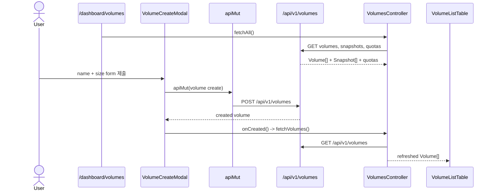
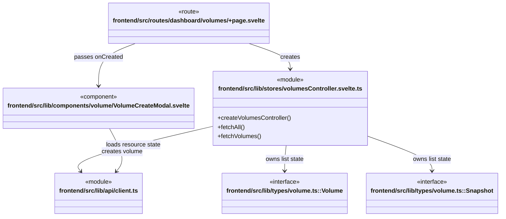

# Block volume workflow

**진입점:** `frontend/src/routes/dashboard/volumes/+page.svelte`는 `VolumesController`를 만들고 create modal 완료 callback으로 volume 목록을 다시 읽는다.

## Sequence

## 시나리오 클래스

## 근거

- `volumes/+page.svelte`는 `createVolumesController`를 만들며 create callback으로 `ctrl.fetchVolumes()`를 전달한다.
- `VolumeCreateModal.svelte`는 `/api/v1/volumes` POST 후 callback을 호출한다.
- `VolumesController.fetchAll`은 volume, snapshot, quota, auto-backup config를 병렬 조회한다.
