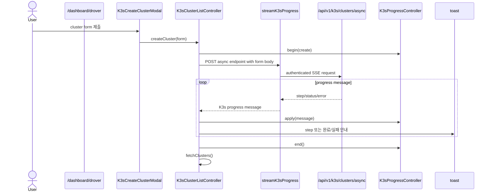
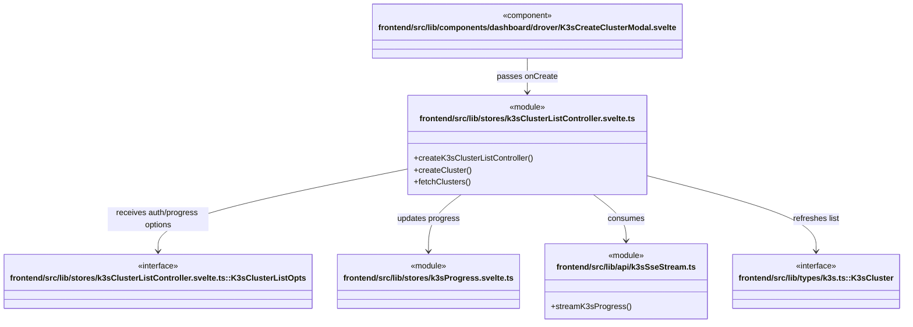

# Drover K3s 생성 workflow

**진입점:** `frontend/src/routes/dashboard/drover/+page.svelte`는 progress controller와 cluster list controller를 만들고 create modal에 `createCluster` action을 전달한다.

## Sequence

## 시나리오 클래스

## 근거

- `k3sClusterListController.svelte.ts::createCluster`는 `streamK3sProgress('/api/v1/k3s/clusters/async', { method: 'POST', body })`를 사용한다.
- 같은 controller는 completion/failure toast를 표시하고 finally에서 목록을 재조회한다.
