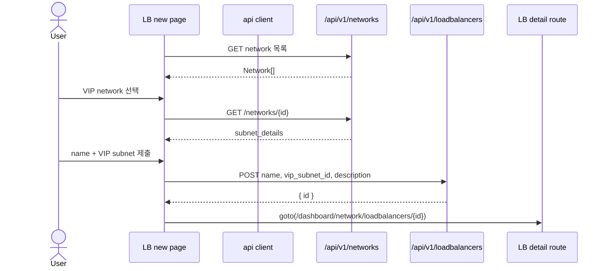
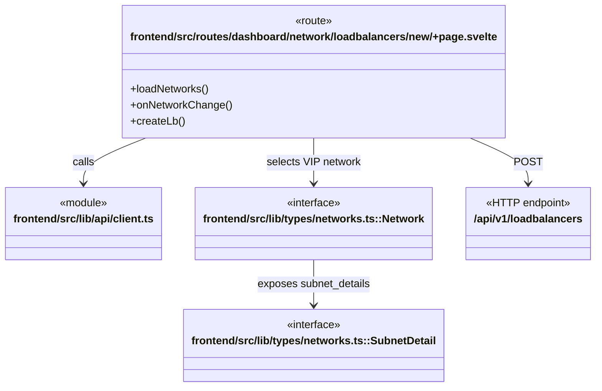

# Load balancer 생성 workflow

**진입점:** `frontend/src/routes/dashboard/network/loadbalancers/new/+page.svelte`가 network 선택과 VIP subnet 선택을 수행한 뒤 load balancer를 생성하고 detail route로 이동한다.

## Sequence

## 시나리오 클래스

## 근거

- `loadbalancers/new/+page.svelte::loadNetworks`는 `/api/v1/networks`를 조회한다.
- `onNetworkChange`는 선택한 network detail에서 `subnet_details`를 읽는다.
- `createLb`는 `/api/v1/loadbalancers` POST 성공 후 detail route로 이동한다.
