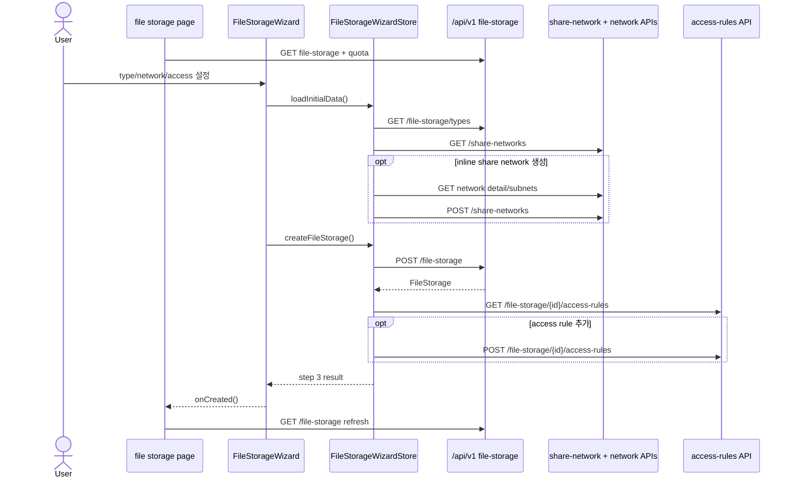
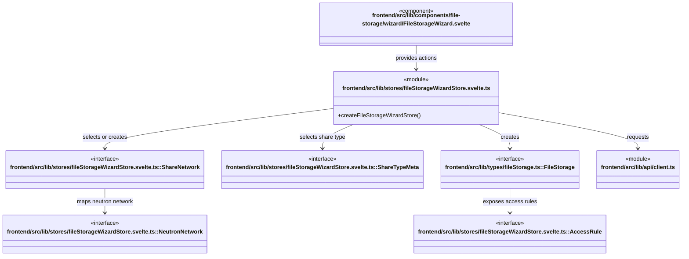

# Manila file storage workflow

**진입점:** `frontend/src/routes/dashboard/file-storage/+page.svelte`의 `FileStorageWizard`는 share type·share network·access rule을 단계적으로 준비하고 Manila file storage를 생성한다.

## Sequence

## 시나리오 클래스

## 근거

- `fileStorageWizardStore.svelte.ts`는 `/api/v1/file-storage/types`, `/api/v1/share-networks`, `/api/v1/networks/{id}`를 사용해 wizard option을 채운다.
- 생성은 `/api/v1/file-storage` POST이며 생성 뒤 access-rule 목록을 조회하고 필요 시 `/access-rules` POST를 수행한다.
