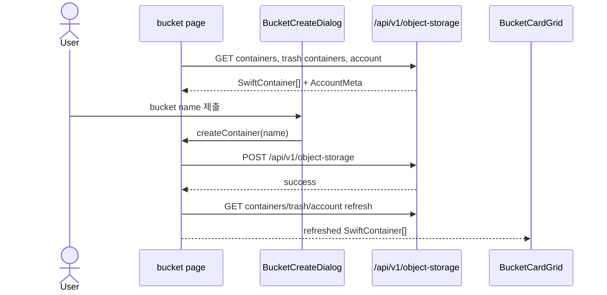
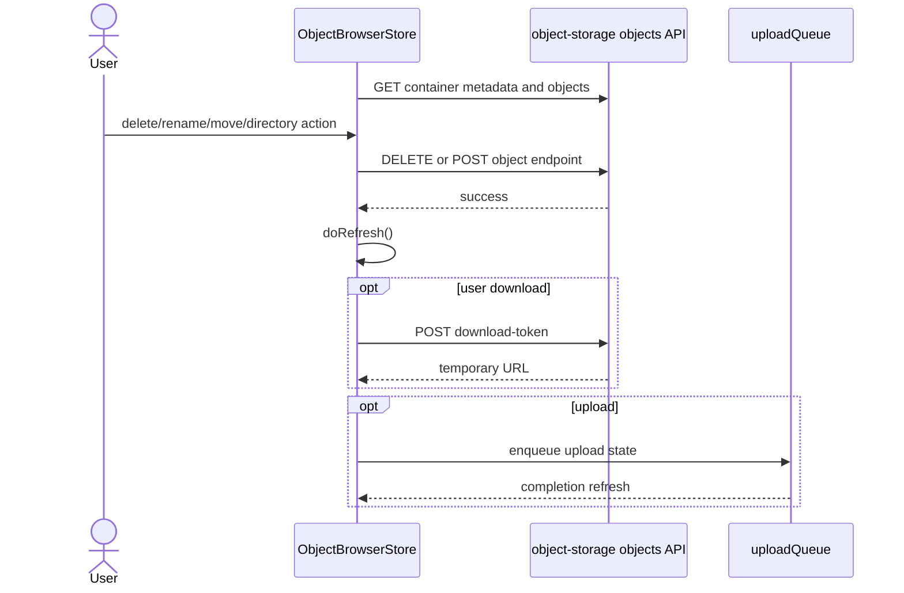
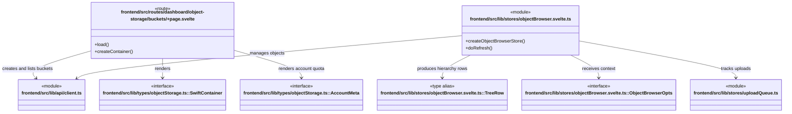

# Object storage workflow

버킷 목록 page는 container·trash·account metadata를 병렬 조회한다. 개별 버킷의 object 작업은 `ObjectBrowserStore`가 list, metadata, delete, rename, move, download-token을 수행한다.

## Bucket sequence

## Object browser sequence

## 시나리오 클래스

## 근거

- bucket route `load`은 container, trash container, account를 `Promise.allSettled`로 조회한다.
- `createContainer`은 `/api/v1/object-storage` POST 후 `load()`를 다시 호출한다.
- `objectBrowser.svelte.ts`는 object list, bulk-delete, metadata, directory, rename, move, download-token endpoints를 route-local controller로 감싼다.
