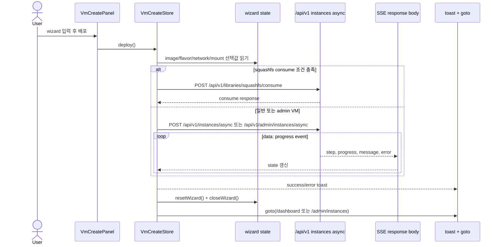
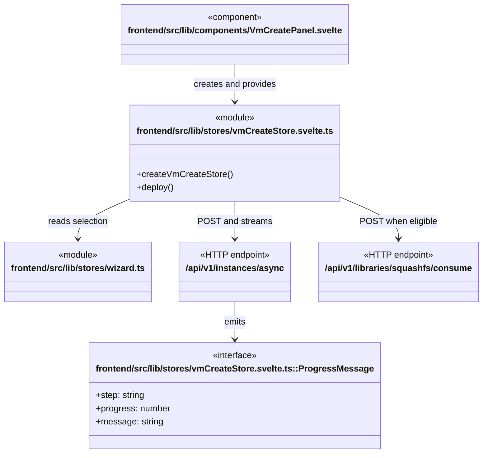

# VM 생성 workflow

**진입점:** `frontend/src/lib/components/VmCreatePanel.svelte`는 `createVmCreateStore()`를 만들고 wizard context에 제공한다. `VmCreateStore.deploy()`가 일반 VM 또는 squashfs consume VM을 선택해 long-running 생성 상태를 화면에 반영한다.

## Sequence

## 시나리오 클래스

## 근거

- `vmCreateStore.svelte.ts::deploy`는 일반 경로에서 `/api/v1/instances/async` 또는 `/api/v1/admin/instances/async`에 `fetch` POST하고 SSE-like `data:` line을 소비한다.
- 같은 함수는 squashfs 선택 시 `/api/v1/libraries/squashfs/consume`을 별도 JSON POST로 호출한다.
- 완료 시 wizard reset/close와 `goto()`를 수행한다.
