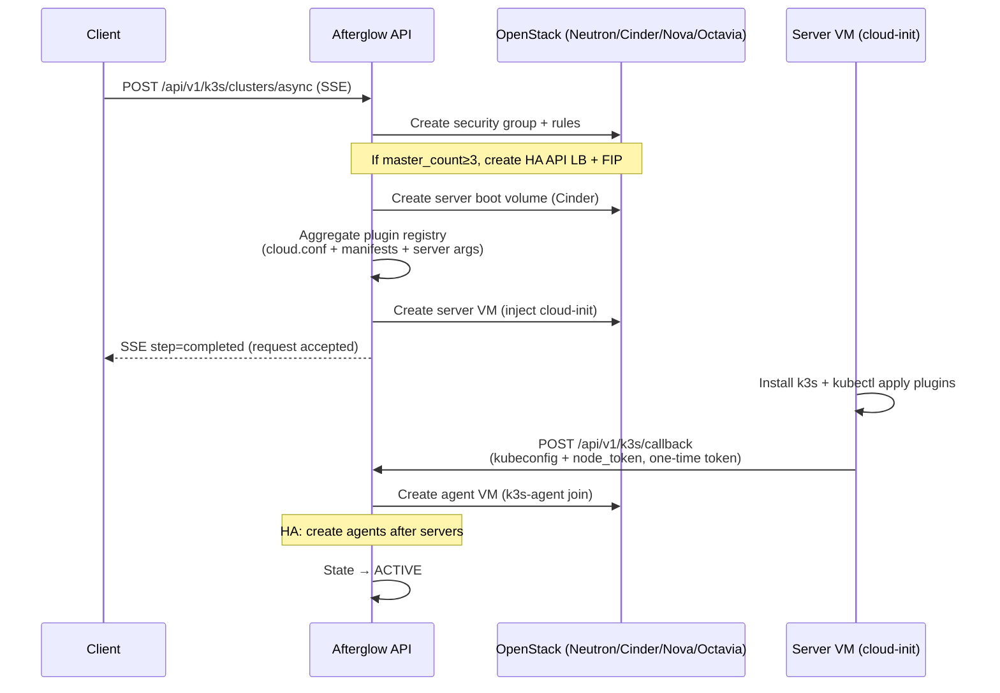

# k3s Cluster (k3s)

The k3s provisioner is a subsystem that installs and operates k3s (lightweight Kubernetes) directly using only OpenStack Nova VMs + cloud-init, **without Magnum**. It handles cluster create/delete/scale, kubeconfig download, HA (embedded-etcd) bootstrap, certificate rotation, node groups, Stampede autoscale, and Cloud Provider OpenStack plugin deployment.

For the proxy-style API that queries/manipulates Kubernetes resources inside the cluster (Pod/Deployment/ConfigMap/Secret/Cloud Shell, etc.), see the separate document [k3s Resource Management](k3s-resources.md).

> **Activation condition:** `afterglow.conf [services] k3s = true`
> When disabled, the router is not mounted and `404` is returned.

---

## Basic Information

| Item | Value |
|------|-----|
| Base path | `/api/v1/k3s/clusters` |
| Template path | `/api/v1/k3s/cluster-templates` |
| Callback path | `/api/v1/k3s/callback` (legacy `/api/k3s/callback` dual-mount) |
| Auth | All endpoints except the callback require an `Authorization: Bearer <access_token>` header (`X-Project-Id` optional) |
| Ownership | All cluster access verifies `cluster.project_id == token project_id`. On mismatch, `404` |
| Tags | `k3s`, `k3s-health`, `k3s-callback`, `k3s-templates`, `k3s-nodegroups`, `k3s-certificates`, etc. |

> All paths are `/api/v1` single-mount. As an exception, only `POST /callback` also keeps the legacy `/api/k3s/callback` for cloud-init baked VM compatibility (adding new legacy routes is prohibited).

---

## Cluster State Flow

```
CREATING → PROVISIONING → ACTIVE → DELETING → DELETED (soft-delete)
                            ↓
                          ERROR
```

| State | Description |
|------|------|
| `CREATING` | Creating security groups/volumes/server VM, before waiting for callback |
| `PROVISIONING` | Server VM callback complete, provisioning agent VMs (or HA servers) |
| `ACTIVE` | Operating normally. scale/shell/cert-rotate possible |
| `SCALING` | Agent count change in progress in the background |
| `ERROR` | Server init/callback failure (see `status_reason`) |
| `DELETING` | Deletion in progress |
| `DELETED` | soft-delete complete. History viewable with `include_deleted=true` |

---

## Cluster Creation Flow

`POST /async` creates resources sequentially, streams progress via SSE, and provisions agents in the background once the cloud-init inside the server VM reports the result to `/callback`.



### SSE Creation Steps (`K3sProgressStep`)

Each event is in `data: {JSON}` form and has a `K3sProgressMessage` (`step`, `progress` 0–100, `message`, `cluster_id?`, `error?`, `elapsed_seconds?`) structure.

| step | Description |
|------|------|
| `security_group` | Create security group and rules |
| `server_ha_bootstrap` | (HA only) Prepare API LoadBalancer + Floating IP |
| `server_volume` | Create server boot volume |
| `server_creating` | Issue App Credential/KEK, generate cloud-init, create server VM |
| `waiting_callback` | Save cluster record, wait for the server VM's k3s install callback |
| `completed` | Creation request accepted (includes `cluster_id`) |
| `failed` | Failure. `progress=0`, includes `error`, rolls back created resources in reverse order |

Example failure event:

```
data: {"step": "failed", "progress": 0, "message": "클러스터 생성 실패: ...", "error": "..."}
```

---

## Cloud Provider OpenStack Plugins

k3s clusters integrate with OpenStack services through a plugin registry (`backend/app/services/k3s_plugins/`). Each plugin is independently enabled in the `afterglow.conf [k3s]` section.

| Plugin | Config key | Deployed resources | Purpose |
|---------|--------|-----------|------|
| **OCCM** | `occm_enabled` | DaemonSet + RBAC | Node initialization, Service LB (Octavia) |
| **Cinder CSI** | `cinder_csi_enabled` | StatefulSet + DaemonSet + CSIDriver | PVC → Cinder block storage |
| **Manila CSI** | `manila_csi_enabled` | StatefulSet + DaemonSet + NFS CSI | PVC → Manila NFS (ReadWriteMany) |
| **Octavia Ingress** | `octavia_ingress_enabled` | StatefulSet + IngressClass | Ingress → Octavia LB |
| **Keystone Auth** | `keystone_auth_enabled` | Deployment + Service (8443) | K8s auth → Keystone token |
| **Barbican KMS** | `barbican_kms_enabled` | DaemonSet (control plane) | K8s Secret at-rest encryption |

### Deployment Mechanism

At cluster creation, the registry aggregates the following and injects them into cloud-init:

| Function | Output |
|------|--------|
| `aggregate_cloud_conf()` | `/etc/kubernetes/cloud.conf` (OCCM + Cinder shared Secret) |
| `aggregate_manifests()` | `/opt/k3s/{plugin}-manifests.yaml` |
| `aggregate_server_args()` | k3s install args (`--kube-apiserver-arg`, etc.) |

- When **Octavia Ingress / Barbican KMS** are enabled, a per-cluster Keystone App Credential is issued once to prevent exposure of OpenStack admin credentials on node compromise.
- When **Barbican KMS** is enabled, the per-project KEK is looked up/issued from Barbican (shared per-project).

The callback script deploys the plugins sequentially and then reports the results in the `plugin_status` field:

```json
{ "plugin_status": { "occm": "deployed", "cinder_csi": "deployed", "manila_csi": "failed" } }
```

On cluster deletion, orphan Octavia LBs created by OCCM/Ingress are matched by the `kube_service_{name}_` / `kube_ingress_{name}_` prefix and cascade-cleaned, and K8s node objects are removed before VM deletion to prevent OCCM infinite retries.

---

## Cluster CRUD

### `GET /api/v1/k3s/clusters`

Returns the cluster list of the current project.

| Query | Type | Default | Description |
|------|------|------|------|
| `include_deleted` | bool | `false` | Include history of soft-deleted clusters |

**Response `200`** `K3sClusterInfo[]`

```json
[
  {
    "id": "cluster-uuid",
    "name": "my-cluster",
    "status": "ACTIVE",
    "server_vm_id": "nova-server-uuid",
    "agent_vm_ids": ["agent-vm-uuid-1"],
    "agent_count": 1,
    "api_address": "https://10.0.0.5:6443",
    "server_ip": "10.0.0.5",
    "network_id": "neutron-net-uuid",
    "k3s_version": "v1.31.4+k3s1",
    "occm_enabled": true,
    "plugins_enabled": {"occm": true, "cinder_csi": true},
    "master_count": 1,
    "stampede_enabled": false,
    "created_at": "2026-01-01T00:00:00"
  }
]
```

### `GET /api/v1/k3s/clusters/{cluster_id}`

Returns a single cluster's detail.

**Response `200`** `K3sClusterInfo` · **Error** `404` cluster not found

### `GET|HEAD /api/v1/k3s/clusters/{cluster_id}/kubeconfig`

Downloads the kubeconfig YAML (`GET`) or checks its existence (`HEAD`).

- **Every `GET` call is recorded in the audit log** (download time + source IP). For forensic tracing in case of token theft.
- A cluster that has not yet received a callback has no kubeconfig, so `404`. A `None` result is not cached.
- Usable externally only when the `server` address in the file is set to a Floating IP.

**Response `200`** `application/yaml` (`Content-Disposition: attachment`) · **Error** `404` not yet generated, `500` decryption failure

```bash
curl -H "Authorization: Bearer $TOKEN" -H "X-Project-Id: $PROJECT" \
     https://afterglow.example.com/api/v1/k3s/clusters/$CLUSTER_ID/kubeconfig \
     -o ~/.kube/afterglow-cluster.yaml
export KUBECONFIG=~/.kube/afterglow-cluster.yaml && kubectl get nodes
```

### `POST /api/v1/k3s/clusters/async`

Asynchronously creates a cluster over an SSE stream. **Rate limit: 5/min.** Depends on the OpenStack scope connection (`get_os_conn`).

**Request body** `CreateK3sClusterRequest`

| Field | Type | Required | Description |
|------|------|------|------|
| `name` | string | — | Cluster name. Starts with a letter/digit, allows letters/digits/hyphens/underscores (max 63 chars). If unspecified, auto-generated as `k3s-<hex8>` |
| `agent_count` | int | — | Worker node count. Default `1`, range `0–10` |
| `agent_flavor_id` | string | — | Worker flavor. If unset, the administrator `k3s.default_agent_flavor` policy is used. |
| `network_id` | string | — | Network ID. If unset, the default network is auto-determined/fallen back to |
| `key_name` | string | — | SSH keypair name |
| `os_type` | string | — | `ubuntu` (default) or `fcos`. `fcos` requires the `k3s_fcos_image_id` setting |
| `allowed_cidrs` | string[] | — | CIDRs allowed for SSH/API (22/6443) access. If unspecified, `0.0.0.0/0`. **Max 20**, validated as valid CIDRs |
| `template_id` | string | — | Cluster template. When specified, defaults are merged (values explicit in the body take precedence) |
| `master_count` | int | — | `1` (single) or `3` (embedded-etcd HA). Any other value is `422` |
| `stampede_enabled` | bool | — | Stampede autoscale mode (development stage, default `false`) |

> If the server image/flavor, agent flavor (`agent_count>0`), or FCOS image is unset, `503` is returned.

**Response `200`** `text/event-stream` — see [SSE Creation Steps](#sse-creation-steps-k3sprogressstep) above.

### `PATCH /api/v1/k3s/clusters/{cluster_id}/scale`

Adjusts the agent (worker) node count. **Rate limit: 10/min.** Allowed only in the `ACTIVE` state.

**Request body** `ScaleK3sClusterRequest` — `{ "agent_count": 3 }` (range `0–10`)

Changes the state to `SCALING` and returns an ack immediately, while the actual VM increase/decrease is handled by a background task.

**Response `200`** (immediate ack)

```json
{ "message": "스케일링 시작: 1 → 3", "agent_count": 3 }
```

**Error** `404` cluster not found · `409` not in ACTIVE state

### `DELETE /api/v1/k3s/clusters/{cluster_id}`

Deletes a cluster. **Rate limit: 5/min.** Cleans up in the order API LB/FIP → App Credential → K8s nodes → agent VMs → server VM → security group, then soft-deletes the DB record.

**Response `204`** No Content · **Error** `404` cluster not found. An already-deleted cluster is ignored with `204`.

### `POST /api/v1/k3s/clusters/{cluster_id}/delete-async`

Streams the same cleanup procedure as `DELETE` via SSE. **Rate limit: 5/min.**

**Response `200`** `text/event-stream` — emits deletion steps (`delete_init`, `delete_lb_cleanup`, `delete_app_credential`, `delete_k8s_nodes`, `delete_agent_vms`, `delete_server_vm`, `delete_security_group`, `delete_record`, `completed`) sequentially.

---

## Node Network Interfaces

Attaches/detaches additional Neutron ports to server/agent VMs. If `vm_id` does not belong to the cluster, `403`.

| Method | Path | Description |
|--------|------|------|
| `GET` | `/{cluster_id}/nodes/{vm_id}/interfaces` | Node interface list (`K3sInterfaceInfo[]`) |
| `POST` | `/{cluster_id}/nodes/{vm_id}/interfaces` | Attach interface (`201`, body `{ "net_id": "..." }`) |
| `DELETE` | `/{cluster_id}/nodes/{vm_id}/interfaces/{port_id}` | Detach interface (`204`) |

---

## Stampede Autoscale

Controls the per-cluster autoscale mode. If the server-global setting `afterglow.conf [k3s] stampede_enabled` is off, enabling returns `400`.

| Method | Path | Description |
|--------|------|------|
| `POST` | `/{cluster_id}/stampede/enable` | Enable Stampede (`200`) |
| `POST` | `/{cluster_id}/stampede/disable` | Disable Stampede (`200`) |
| `GET` | `/{cluster_id}/stampede` | Per-cluster/node-group Stampede status (in-flight, capacity, quota, etc.) |
| `GET` | `/{cluster_id}/stampede/events` | Scale event history (newest first, `limit` 1–200 default 50) |

---

## Health Check

Returns the health results stored in Redis by worker pods, or triggers an immediate probe.

### `GET /api/v1/k3s/clusters/{cluster_id}/health`

Returns the latest health status of a single cluster (Redis cache).

**Response `200`** `K3sClusterHealth` · **Error** `404` cluster not found or health data not collected

```json
{
  "cluster_id": "uuid",
  "cluster_name": "my-cluster",
  "status": "HEALTHY",
  "api_server_reachable": true,
  "healthz_ok": true,
  "nodes": [
    {"name": "my-cluster-server", "role": "server", "ready": true, "conditions": ["Ready"], "kubelet_version": "v1.31.4+k3s1"}
  ],
  "checked_at": "2026-01-01T00:10:00",
  "reachability": "direct"
}
```

**Health status values:** `HEALTHY` (all nodes Ready) · `DEGRADED` (some unhealthy) · `UNHEALTHY` (many unhealthy) · `UNREACHABLE` (API unreachable) · `UNKNOWN` (no data)

### `POST /api/v1/k3s/clusters/{cluster_id}/health/check`

Triggers a health check immediately without waiting for the worker cycle. **Rate limit: 3/min.**

**Response `200`** `K3sClusterHealth` · **Error** `404` cluster not found, `500` check failure

---

## Cluster Templates

Base path `/api/v1/k3s/cluster-templates`. Referenced by `template_id` at creation to fill in form defaults. Reads are for users (public or self-created), while changes are **admin only**.

| Method | Path | Auth | Description |
|--------|------|------|------|
| `GET` | `/api/v1/k3s/cluster-templates` | User | Template list (public + self-created) |
| `GET` | `/api/v1/k3s/cluster-templates/{template_id}` | User | Single fetch (private + owned-by-other is `404`) |
| `POST` | `/api/v1/k3s/cluster-templates` | **admin** | Create template (`201`) |
| `PATCH` | `/api/v1/k3s/cluster-templates/{template_id}` | **admin** | Update template |
| `DELETE` | `/api/v1/k3s/cluster-templates/{template_id}` | **admin** | Delete template (soft-delete, `204`) |

Key `CreateK3sClusterTemplateRequest` fields: `name` (required, same name rules), `k3s_version`, `default_node_count` (0–20), `default_agent_flavor_id`, `default_image_id`, `plugins_enabled`, `os_type` (`ubuntu`/`fcos`), `public_visible`.

---

## Node Groups

Base path `/api/v1/k3s/clusters/{cluster_id}/nodegroups`. Splits a cluster into multiple worker groups to manage flavor/labels/taints/autoscale individually.

| Method | Path | Description |
|--------|------|------|
| `GET` | `/{cluster_id}/nodegroups` | Node group list |
| `GET` | `/{cluster_id}/nodegroups/{nodegroup_id}` | Single fetch |
| `POST` | `/{cluster_id}/nodegroups` | Create (`201`). If `role=agent` and `node_count>0`, VM provisioning starts |
| `PATCH` | `/{cluster_id}/nodegroups/{nodegroup_id}` | Update. On `node_count` change, VMs increase/decrease |
| `DELETE` | `/{cluster_id}/nodegroups/{nodegroup_id}` | Delete (soft-delete, `204`). The default group cannot be deleted |

**Input validation (command injection defense):**

- `role` allows only `agent` — a custom `server` node group is not supported (`422`). Changing `node_count` of a `server` group is also `422`.
- `labels` keys/values and `taints` keys/values/effect are whitelist-validated with the K8s naming-rule regex (blocking shell metacharacters). `effect` allows only `NoSchedule`/`PreferNoSchedule`/`NoExecute`. Violations are `422`.
- `stampede_enabled=true` requires `flavor_id` and `min_size ≤ max_size`.

---

## Certificates

Base path `/api/v1/k3s/clusters/{cluster_id}`. kubeconfig access permission (= cluster ownership) must be confirmed.

### `GET /{cluster_id}/ca-certificate`

Downloads the CA certificate PEM.

**Response `200`** `application/x-pem-file` (attachment) · **Error** `404` cluster/kubeconfig not found, `500` extraction failure

### `GET /{cluster_id}/certificate-expiry`

Returns CA/client/server TLS certificate expiry information (1-hour cache).

**Response `200`** `CertificateExpiryResponse` (`ca`, `client`, `server_via_tls[]` each with `not_after`/`not_before`/`subject`/`issuer`/`days_remaining`)

### `POST /{cluster_id}/rotate-certs`

Creates a K8s Job on control-plane nodes to run `systemctl restart k3s` sequentially, renewing certificates within 90 days of expiry (SSE stream).

- **Supported only on HA (`master_count ≥ 3`) clusters.** A single master would cause API downtime during restart, so `422`.
- If the cluster is not in `ACTIVE`/`ERROR` state, `409`.
- A Redis distributed lock prevents concurrent rotation — if one is already in progress, `409`.

**Response `200`** `text/event-stream` (`rotate_discover`/`rotate_server`/`rotate_agent`/`rotate_verify` steps)

---

## Callback (Server VM → Server)

### `POST /api/v1/k3s/callback`

The endpoint where the server VM's cloud-init reports the kubeconfig + node_token. **No auth header required** — instead it authenticates with the **one-time callback token** issued at cluster creation, and logs the source IP for audit purposes. **Rate limit: 10/min.**

> **Legacy dual-mount:** For compatibility with existing VMs that have the value baked into cloud-init, `POST /api/k3s/callback` (legacy without prefix) works identically. These two paths are a baked contract and are not removed.

- Single master: after consuming the token, background-spawns agent VM provisioning.
- HA server #1: spawns bootstrap of servers #2/#3. Servers #2/#3 (`server_index ≥ 2`): add LB members + increment the join counter, and provision agents once all have joined.
- Invalid or expired tokens return `403 Forbidden`.

**Request body** `K3sCallbackRequest`: `token` (8–128 chars, required), `success` (required), `kubeconfig` (≤64KB), `node_token` (≤512 chars, metacharacter whitelist-validated), `server_ip` (IP format validated), `error`, `plugin_status`, `secret_cloud_config_status`.

**Response `200`** `{ "ok": true }`

---

## Schema Summary

### `K3sClusterInfo`

| Field | Type | Description |
|------|------|------|
| `id` | string | Cluster UUID |
| `name` | string | Cluster name |
| `status` | string | `CREATING`/`PROVISIONING`/`ACTIVE`/`SCALING`/`ERROR`/`DELETING`/`DELETED` |
| `status_reason` | string? | Error/state reason |
| `server_vm_id` | string? | Master node Nova VM UUID |
| `agent_vm_ids` | string[] | Worker node VM UUID list |
| `agent_count` | int | Current worker node count |
| `api_address` | string? | Kubernetes API address (`https://IP:6443`) |
| `server_ip` | string? | Master node IP |
| `network_id` | string? | Connected Neutron network |
| `key_name` | string? | SSH keypair name |
| `k3s_version` | string? | Installed k3s version |
| `occm_enabled` | bool | Whether OCCM is enabled |
| `plugins_enabled` | object | Plugin enable map (`{"occm": true, ...}`) |
| `master_count` | int | Master count (1 or 3) |
| `stampede_enabled` | bool | Whether Stampede autoscale is enabled |
| `api_lb_id` / `api_fip_id` / `api_fip_address` | string? | HA API LoadBalancer / Floating IP |
| `created_at` / `updated_at` / `deleted_at` | string? | ISO 8601 timestamps |
| `health_status` | string? | Latest health check result |

### `K3sClusterHealth`

| Field | Type | Description |
|------|------|------|
| `cluster_id` / `cluster_name` | string | Cluster identification |
| `status` | string | `HEALTHY`/`DEGRADED`/`UNHEALTHY`/`UNREACHABLE`/`UNKNOWN` |
| `api_server_reachable` | bool | API server reachable |
| `healthz_ok` | bool | `/healthz` OK |
| `nodes` | `K3sNodeHealth[]` | Per-node `name`/`role`/`ready`/`conditions`/`kubelet_version` |
| `checked_at` | string | Check time |
| `reachability` | string | `direct` / `unreachable` |
