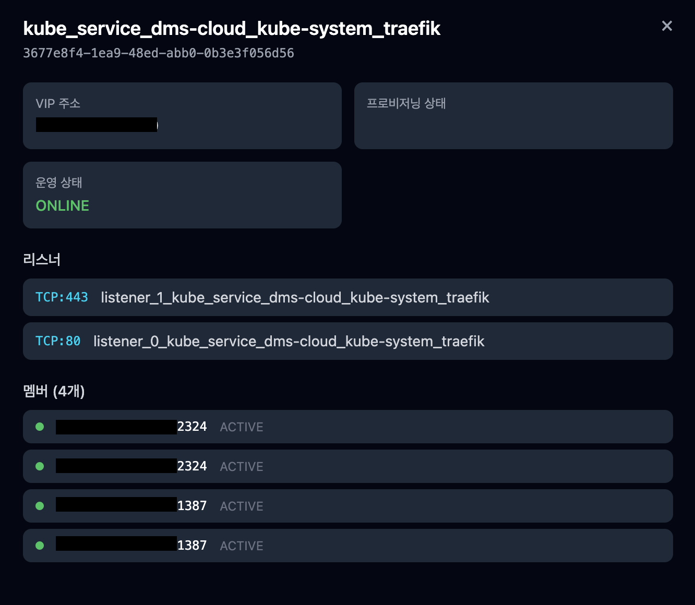

# Load Balancers API

> Tag: `loadbalancers`  
> Base path: `/api/v1/loadbalancers`

Manages Octavia load balancers, listeners, pools, members, and health monitors.

---

## Authentication Headers

| Header | Description |
|------|------|
| `Authorization` | `Bearer <access_token>` (access JWT from login) |
| `X-Project-Id` | (Optional) Project UUID — defaults to the JWT's project; a different value triggers rescope |

---

## Table of Contents

1. [Load Balancers](#1-load-balancers)
2. [Listeners](#2-listeners)
3. [Pools](#3-pools)
4. [Members](#4-members)
5. [Health Monitors](#5-health-monitors)

---

## 1. Load Balancers

### Endpoint List

| Method | Path | Description |
|--------|------|------|
| `GET` | `/api/v1/loadbalancers` | Load balancer list (30s cache) |
| `POST` | `/api/v1/loadbalancers` | Create load balancer |
| `GET` | `/api/v1/loadbalancers/{lb_id}` | Load balancer detail |
| `DELETE` | `/api/v1/loadbalancers/{lb_id}` | Delete load balancer |

### GET /api/v1/loadbalancers

Returns the project's Octavia load balancer list. The response is cached for 30 seconds.

**Response (200 OK)** — array

### POST /api/v1/loadbalancers

Creates a new load balancer.

**Request body**

```json
{
  "name": "string (required)",
  "vip_subnet_id": "uuid-string (required)",
  "description": "string (optional)"
}
```

| Field | Type | Required | Description |
|------|------|------|------|
| `name` | string | Yes | Load balancer name |
| `vip_subnet_id` | string | Yes | UUID of the subnet where the VIP will be allocated |
| `description` | string | No | Description |

**Response (201 Created)**

### GET /api/v1/loadbalancers/{lb_id}


*Check the VIP address, provisioning/operating status (ONLINE), TCP listeners (443/80), and backend member pool status (ACTIVE) in the detail panel*

Returns detailed information for a specific load balancer.

| Parameter | Location | Type | Required | Description |
|----------|------|------|------|------|
| `lb_id` | path | string | Yes | Load balancer UUID |

### DELETE /api/v1/loadbalancers/{lb_id}

Deletes a load balancer. Its child listeners and pools are deleted along with it.

**Response**: `204 No Content`

---

## 2. Listeners

### Endpoint List

| Method | Path | Description |
|--------|------|------|
| `GET` | `/api/v1/loadbalancers/{lb_id}/listeners` | Listener list |
| `POST` | `/api/v1/loadbalancers/{lb_id}/listeners` | Create listener |
| `DELETE` | `/api/v1/loadbalancers/{lb_id}/listeners/{listener_id}` | Delete listener |

### GET /api/v1/loadbalancers/{lb_id}/listeners

Returns the load balancer's listener list.

### POST /api/v1/loadbalancers/{lb_id}/listeners

Creates a listener.

**Request body**

```json
{
  "protocol": "HTTP",
  "protocol_port": 80,
  "name": "string (optional)",
  "default_pool_id": "uuid-string (optional)"
}
```

| Field | Type | Required | Description |
|------|------|------|------|
| `protocol` | string | Yes | Protocol (`HTTP`, `HTTPS`, `TCP`, `UDP`, etc.) |
| `protocol_port` | integer | Yes | Port number |
| `name` | string | No | Listener name |
| `default_pool_id` | string | No | Default pool UUID |

### DELETE /api/v1/loadbalancers/{lb_id}/listeners/{listener_id}

Deletes a listener.

**Response**: `204 No Content`

---

## 3. Pools

### Endpoint List

| Method | Path | Description |
|--------|------|------|
| `GET` | `/api/v1/loadbalancers/{lb_id}/pools` | Pool list |
| `POST` | `/api/v1/loadbalancers/{lb_id}/pools` | Create pool |
| `DELETE` | `/api/v1/loadbalancers/{lb_id}/pools/{pool_id}` | Delete pool |

### GET /api/v1/loadbalancers/{lb_id}/pools

Returns the load balancer's pool list.

### POST /api/v1/loadbalancers/{lb_id}/pools

Creates a pool.

**Request body**

```json
{
  "protocol": "HTTP",
  "lb_algorithm": "ROUND_ROBIN",
  "name": "string (optional)",
  "listener_id": "uuid-string (optional)"
}
```

| Field | Type | Required | Description |
|------|------|------|------|
| `protocol` | string | Yes | Protocol (`HTTP`, `HTTPS`, `TCP`, `UDP`, etc.) |
| `lb_algorithm` | string | Yes | Load balancing algorithm (`ROUND_ROBIN`, `LEAST_CONNECTIONS`, `SOURCE_IP`, etc.) |
| `name` | string | No | Pool name |
| `listener_id` | string | No | UUID of the listener to connect |

### DELETE /api/v1/loadbalancers/{lb_id}/pools/{pool_id}

Deletes a pool.

**Response**: `204 No Content`

---

## 4. Members

### Endpoint List

| Method | Path | Description |
|--------|------|------|
| `GET` | `/api/v1/loadbalancers/{lb_id}/pools/{pool_id}/members` | Member list |
| `POST` | `/api/v1/loadbalancers/{lb_id}/pools/{pool_id}/members` | Add member |
| `DELETE` | `/api/v1/loadbalancers/{lb_id}/pools/{pool_id}/members/{member_id}` | Remove member |

### GET /api/v1/loadbalancers/{lb_id}/pools/{pool_id}/members

Returns the pool's member list.

### POST /api/v1/loadbalancers/{lb_id}/pools/{pool_id}/members

Adds a member to the pool.

**Request body**

```json
{
  "address": "192.168.1.10 (required)",
  "protocol_port": 8080,
  "subnet_id": "uuid-string (optional)",
  "name": "string (optional)",
  "weight": 1
}
```

| Field | Type | Required | Description |
|------|------|------|------|
| `address` | string | Yes | Member IP address |
| `protocol_port` | integer | Yes | Port number |
| `subnet_id` | string | No | UUID of the subnet the member belongs to |
| `name` | string | No | Member name |
| `weight` | integer | No | Weight (default: `1`) |

### DELETE /api/v1/loadbalancers/{lb_id}/pools/{pool_id}/members/{member_id}

Removes a member.

**Response**: `204 No Content`

---

## 5. Health Monitors

### Endpoint List

| Method | Path | Description |
|--------|------|------|
| `GET` | `/api/v1/loadbalancers/{lb_id}/pools/{pool_id}/health-monitor` | Get health monitor |
| `POST` | `/api/v1/loadbalancers/{lb_id}/pools/{pool_id}/health-monitor` | Create health monitor |
| `DELETE` | `/api/v1/loadbalancers/{lb_id}/pools/{pool_id}/health-monitor/{hm_id}` | Delete health monitor |

### GET /api/v1/loadbalancers/{lb_id}/pools/{pool_id}/health-monitor

Returns the pool's health monitor information.

### POST /api/v1/loadbalancers/{lb_id}/pools/{pool_id}/health-monitor

Creates a health monitor.

**Request body**

```json
{
  "type": "HTTP",
  "delay": 5,
  "timeout": 5,
  "max_retries": 3,
  "name": "string (optional)"
}
```

| Field | Type | Required | Description |
|------|------|------|------|
| `type` | string | Yes | Health check type (`HTTP`, `HTTPS`, `TCP`, `PING`, etc.) |
| `delay` | integer | Yes | Check interval (seconds) |
| `timeout` | integer | Yes | Timeout (seconds) |
| `max_retries` | integer | Yes | Maximum retry count |
| `name` | string | No | Health monitor name |

### DELETE /api/v1/loadbalancers/{lb_id}/pools/{pool_id}/health-monitor/{hm_id}

Deletes a health monitor.

**Response**: `204 No Content`
