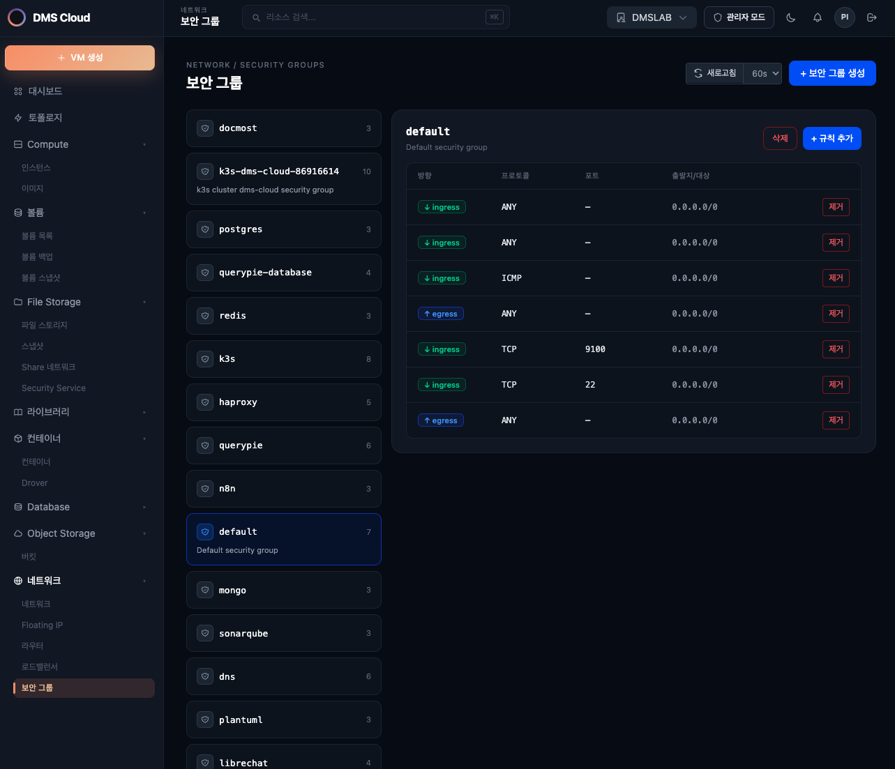

# Security Groups API

> Tag: `security-groups`  
> Base path: `/api/v1/security-groups`

Manages Neutron security groups and rules. Used to control network traffic access for instances.

---

## Authentication Headers

| Header | Description |
|------|------|
| `Authorization` | `Bearer <access_token>` (access JWT from login) |
| `X-Project-Id` | (Optional) Project UUID — defaults to the JWT's project; a different value triggers rescope |

---

## Table of Contents

1. [Security Groups](#1-security-groups)
2. [Security Group Rules](#2-security-group-rules)

---

## 1. Security Groups

### Endpoint List

| Method | Path | Description |
|--------|------|------|
| `GET` | `/api/v1/security-groups` | Security group list (60s cache) |
| `POST` | `/api/v1/security-groups` | Create security group |
| `DELETE` | `/api/v1/security-groups/{sg_id}` | Delete security group |

### GET /api/v1/security-groups

Returns the project's security group list. The response is cached for 60 seconds.

**Response (200 OK)** — array

```json
[
  {
    "id": "uuid-string",
    "name": "default",
    "description": "Default security group",
    "rules": [
      {
        "id": "uuid-string",
        "direction": "ingress",
        "protocol": null,
        "port_range_min": null,
        "port_range_max": null,
        "remote_ip_prefix": null,
        "ethertype": "IPv4"
      }
    ]
  }
]
```

### POST /api/v1/security-groups

Creates a new security group.

**Request body**

```json
{
  "name": "string (required)",
  "description": "string (optional)"
}
```

| Field | Type | Required | Description |
|------|------|------|------|
| `name` | string | Yes | Security group name |
| `description` | string | No | Description |

**Response (201 Created)**

### DELETE /api/v1/security-groups/{sg_id}

Deletes a security group. The default security group cannot be deleted.

| Parameter | Location | Type | Required | Description |
|----------|------|------|------|------|
| `sg_id` | path | string | Yes | Security group UUID |

**Response**: `204 No Content`

---

## 2. Security Group Rules


*Security group inbound/outbound rule list — edit protocol/port range/source CIDR and add rules*

### Endpoint List

| Method | Path | Description |
|--------|------|------|
| `POST` | `/api/v1/security-groups/{sg_id}/rules` | Add security group rule |
| `DELETE` | `/api/v1/security-groups/{sg_id}/rules/{rule_id}` | Delete security group rule |

### POST /api/v1/security-groups/{sg_id}/rules

Adds a new rule to a security group.

**Request body**

```json
{
  "direction": "ingress",
  "protocol": "tcp",
  "port_range_min": 22,
  "port_range_max": 22,
  "remote_ip_prefix": "0.0.0.0/0",
  "ethertype": "IPv4"
}
```

| Field | Type | Required | Description |
|------|------|------|------|
| `direction` | string | Yes | Traffic direction (`ingress`, `egress`) |
| `protocol` | string | No | Protocol (`tcp`, `udp`, `icmp`, `null` = all protocols) |
| `port_range_min` | integer | No | Minimum port number |
| `port_range_max` | integer | No | Maximum port number |
| `remote_ip_prefix` | string | No | Remote IP range (CIDR notation, e.g., `0.0.0.0/0`) |
| `ethertype` | string | No | Ethertype (`IPv4`, `IPv6`, default: `IPv4`) |

| direction allowed value | Description |
|-------------------|------|
| `ingress` | Inbound traffic (receive) |
| `egress` | Outbound traffic (send) |

| protocol allowed value | Description |
|-----------------|------|
| `tcp` | TCP |
| `udp` | UDP |
| `icmp` | ICMP |
| `null` | All protocols |

**Response (201 Created)**

```json
{
  "id": "uuid-string",
  "direction": "ingress",
  "protocol": "tcp",
  "port_range_min": 22,
  "port_range_max": 22,
  "remote_ip_prefix": "0.0.0.0/0",
  "ethertype": "IPv4",
  "security_group_id": "uuid-string"
}
```

### DELETE /api/v1/security-groups/{sg_id}/rules/{rule_id}

Deletes a security group rule.

| Parameter | Location | Type | Required | Description |
|----------|------|------|------|------|
| `sg_id` | path | string | Yes | Security group UUID |
| `rule_id` | path | string | Yes | Rule UUID |

**Response**: `204 No Content`
