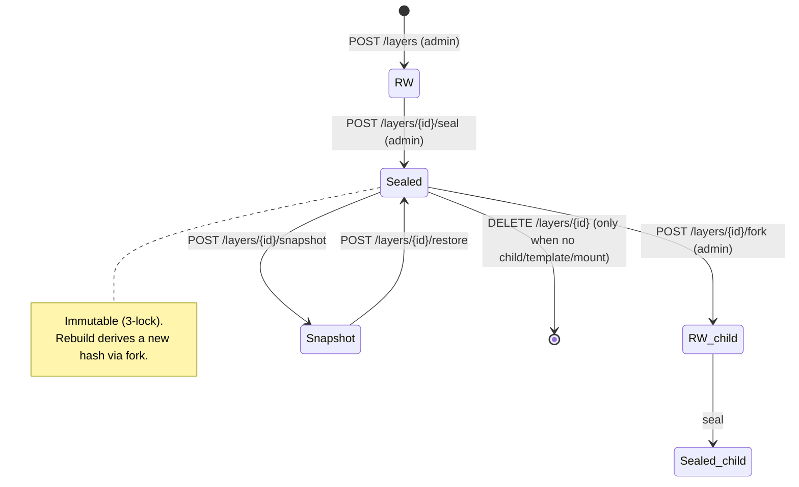

# Union Layers API

> Tags: `union`, `admin-libraries`, `squashfs-libraries`
> Base paths: `/api/v1/union`, `/api/v1/admin/libraries`, `/api/v1/libraries/squashfs`
> Authentication: `Authorization: Bearer <access_token>` · `X-Project-Id` (optional, for rescope)

The API for Afterglow's flagship feature — the **layer-based environment platform**. Like Docker images, it stores package/toolchain layers centrally (on CephFS) and composes them onto a base disk with OverlayFS at VM boot time. Rather than containers, layers are mounted directly inside the VM, and storage sharing is done through Manila (CephFS/NFS) shares.

This API consists of **two subsystems with different path prefixes**. The two systems have different data models, so take care not to confuse them.

| Subsystem | Prefix | Source | Layer identifier | Storage | Description |
|------------|--------|--------|------------------|---------|-------------|
| **Union layers** | `/api/v1/union` | `union/layers.py` | `sha256:<64hex>` (content-addressable) | CephFS + OverlayFS | Implements the `union.md` design document. seal/fork/snapshot, single-parent inheritance, templates. |
| **squashfs libraries (admin)** | `/api/v1/admin/libraries` | `union/layer_ops.py` | integer artifact ID | squashfs NFS share | Build/consume pipeline. `kind` contract (uv→python→pip), profiles, publication settings. **All endpoints are admin-only.** |
| **Public squashfs catalog** | `/api/v1/libraries/squashfs` | `union/layer_public.py` | integer artifact ID | squashfs NFS share | Lets regular users browse and consume sealed, published artifacts/profiles. |

> **Note:** The `sha256` content-addressable model (Union layers) and the integer artifact model (squashfs libraries) are separate. The artifact created by `POST /api/v1/admin/libraries/build` is not a sha256 content-addressable layer.

---

## Table of Contents

1. [Core Concepts](#core-concepts)
2. [Endpoint List](#endpoint-list)
3. [Detail — Union Layers (`/api/v1/union`)](#detail--union-layers-apiv1union)
4. [Detail — squashfs Libraries (`/api/v1/admin/libraries`)](#detail--squashfs-libraries-apiv1adminlibraries)
5. [Detail — Public squashfs Catalog (`/api/v1/libraries/squashfs`)](#detail--public-squashfs-catalog-apiv1librariessquashfs)

---

## Core Concepts

> This section covers concepts limited to the **Union layers (`/api/v1/union`)** subsystem. The squashfs libraries use integer artifact IDs and the `kind` contract, and do not follow the content-addressable/seal/fork model below.

- **Content-addressable & immutable.** A layer ID is the sha256 hash of the diff tree (`sha256:<64hex>`). Identical content always has the same ID, and once sealed it is immutable forever.
- **Single-parent inheritance.** Each layer has 0 (top-level) or 1 (`parent_id`) parent, forming a linked-list structure. Specifying a leaf layer automatically determines the ancestor chain. (Multiple parents via `parent_ids` is an experimental opt-in.)
- **3-lock immutability.** On sealing, writes are rejected at the application level via (1) file permissions (`chmod a-w`), (2) the immutable bit (`chattr +i`), and (3) DB `sealed=true`.
- **Deletion constraints (GC).** A layer cannot be deleted if it has child layers, is referenced by a template, or has active mounts (GC is allowed only on leaves).
- **RW → sealed → fork lifecycle.** A new layer is registered in the RW state and becomes immutable once sealed. To do new work based on a sealed layer, you fork a new RW layer from it (a rebuild adds a new hash rather than overwriting).



### Authorization Model (Union Layers)

- **Authentication:** Most endpoints require `Authorization: Bearer <access_token>` (plus optional `X-Project-Id`, `get_token_info`).
  - **Exception:** `POST /mounts` and `POST /mounts/{id}/unmount` require a **VM Bearer token** (`Authorization: Bearer <token>`) rather than a user token. Only VM health tokens are accepted; if absent or invalid, the response is 401.
- **Admin determination:** Write and destructive operations are checked by the handler-internal `_require_admin` (the token's `is_system_admin`); non-admins receive 403.
- **Project isolation (`_can_access_layer`):**
  - Admins can access all layers.
  - **Shared layers** with a `null` `project_id` are accessible to anyone.
  - Otherwise, access is granted only when the token's `project_id` matches; on mismatch a **404** (existence concealment) is returned.

---

## Endpoint List

### Union layers — user-callable (`/api/v1/union`)

| Method | Path | Description |
|--------|------|-------------|
| `GET` | `/api/v1/union/layers` | List layers (name filter, pagination, project isolation) |
| `GET` | `/api/v1/union/layers/{layer_id}` | Layer detail |
| `GET` | `/api/v1/union/layers/{layer_id}/ancestors` | Ancestor chain (base-first, for lowerdir assembly) |
| `GET` | `/api/v1/union/layers/{layer_id}/dependents` | List of direct child layers |
| `GET` | `/api/v1/union/templates` | List templates |
| `GET` | `/api/v1/union/templates/{name}/{version}` | Template detail (includes resolved_stack) |
| `GET` | `/api/v1/union/stats/storage` | Storage usage statistics |

### Union layers — admin-only (`/api/v1/union`)

| Method | Path | Description |
|--------|------|-------------|
| `POST` | `/api/v1/union/layers` | Register a new layer |
| `DELETE` | `/api/v1/union/layers/{layer_id}` | Delete a layer (409 if child/template/mount exists) |
| `POST` | `/api/v1/union/layers/{layer_id}/seal` | Seal a layer (make immutable) |
| `POST` | `/api/v1/union/layers/{layer_id}/fork` | Derive an RW layer from a sealed layer |
| `POST` | `/api/v1/union/layers/{layer_id}/snapshot` | Create a Manila share snapshot |
| `POST` | `/api/v1/union/layers/{layer_id}/restore` | Restore a Manila share snapshot |
| `POST` | `/api/v1/union/templates` | Create a new template |
| `DELETE` | `/api/v1/union/templates/{name}/{version}` | Delete a template |
| `POST` | `/api/v1/union/builder/access` | Grant `layer-store-rw` CephX access to a builder VM |
| `DELETE` | `/api/v1/union/builder/access/{access_id}` | Revoke builder CephX access |
| `POST` | `/api/v1/union/user/access` | Grant `layer-store-ro` CephX access to a user VM |
| `DELETE` | `/api/v1/union/user/access/{access_id}` | Revoke user CephX access |

### Union layers — VM Bearer token only (`/api/v1/union`)

| Method | Path | Description |
|--------|------|-------------|
| `POST` | `/api/v1/union/mounts` | Add a mount record (VM Bearer) |
| `POST` | `/api/v1/union/mounts/{mount_id}/unmount` | Record an unmount (own mounts only) |

### squashfs libraries — admin-only (`/api/v1/admin/libraries`)

> **Every** endpoint in this group is `Depends(require_admin)` — admin-only.

| Method | Path | Description |
|--------|------|-------------|
| `GET` | `/api/v1/admin/libraries/base-images` | List Ubuntu Glance images for booting builder/consume VMs |
| `POST` | `/api/v1/admin/libraries/imports/dockerfile` | Create a layer import job from a Dockerfile |
| `GET` | `/api/v1/admin/libraries/imports` | List import jobs |
| `GET` | `/api/v1/admin/libraries/imports/{import_id}` | Import job detail |
| `POST` | `/api/v1/admin/libraries/build` | Start a squashfs layer build (background) |
| `GET` | `/api/v1/admin/libraries/builds` | List builds (max 50) |
| `GET` | `/api/v1/admin/libraries/builds/{build_id}` | Build detail + live VM status/console |
| `POST` | `/api/v1/admin/libraries/builds/{build_id}/cancel` | Cancel an in-progress build |
| `POST` | `/api/v1/admin/libraries/consume` | Create a consume instance |
| `GET` | `/api/v1/admin/libraries/consumes` | List consume instances |
| `GET` | `/api/v1/admin/libraries/consumes/{consume_id}` | Consume instance detail + live Nova status |
| `GET` | `/api/v1/admin/libraries/artifacts` | List built artifacts (includes lineage/deletion metadata) |
| `GET` | `/api/v1/admin/libraries/artifacts/{artifact_id}/delete-preview` | Whether an artifact can be deleted / blocking reasons |
| `PATCH` | `/api/v1/admin/libraries/artifacts/{artifact_id}/publication` | Set artifact public/private |
| `DELETE` | `/api/v1/admin/libraries/artifacts/{artifact_id}` | Delete an artifact (only leaves with no blocking reasons) |
| `POST` | `/api/v1/admin/libraries/profiles` | Create/update a profile (upsert) |
| `GET` | `/api/v1/admin/libraries/profiles` | List profiles |
| `GET` | `/api/v1/admin/libraries/profiles/{profile_name}` | Profile detail |
| `PATCH` | `/api/v1/admin/libraries/profiles/{profile_name}/publication` | Set profile public/private |
| `DELETE` | `/api/v1/admin/libraries/profiles/{profile_name}` | Delete a profile (only when no active consume) |

### Public squashfs catalog (`/api/v1/libraries/squashfs`)

| Method | Path | Description |
|--------|------|-------------|
| `GET` | `/api/v1/libraries/squashfs/artifacts` | List public, sealed artifacts |
| `GET` | `/api/v1/libraries/squashfs/profiles` | List published profiles |
| `POST` | `/api/v1/libraries/squashfs/consume` | Create a VM consume instance from a public artifact/profile |

---

## Detail — Union Layers (`/api/v1/union`)

### GET /api/v1/union/layers

Returns a list of layers. Project isolation applies, so non-admins see only their project's layers and shared layers (`project_id=null`).

| Parameter | In | Type | Required | Default | Description |
|-----------|-----|------|----------|---------|-------------|
| `name` | query | string | No | `null` | Name filter |
| `limit` | query | integer | No | `50` | Page size (`1`–`200`) |
| `offset` | query | integer | No | `0` | Offset (`≥0`) |

**Response (200 OK)** — array of `LayerInfo`

```json
[
  {
    "id": "sha256:abc0123...(64hex)",
    "name": "pytorch",
    "version": "2.4.1",
    "created_at": "2026-04-24T09:00:00Z",
    "created_by": "jung-geun",
    "sealed": true,
    "sealed_at": "2026-04-24T09:05:00Z",
    "parent_id": "sha256:cuda...(64hex)",
    "parent_ids": null,
    "project_id": null,
    "ubuntu_base": "ubuntu-24.04-server-20260401.qcow2",
    "build_recipe": {},
    "installed_packages": {},
    "content_hash": "sha256:abc0123...(64hex)",
    "size_bytes": 2847392000,
    "file_count": 18234,
    "license_type": null,
    "max_concurrent_mounts": null
  }
]
```

### GET /api/v1/union/layers/{layer_id}

Returns the details of a layer.

| Parameter | In | Type | Required | Description |
|-----------|-----|------|----------|-------------|
| `layer_id` | path | string | Yes | Layer ID (`sha256:<64hex>`) |

**Constraints**
- Project isolation applies. Both inaccessible and non-existent layers respond with **404**.

**Response (200 OK)**: `LayerInfo`

### POST /api/v1/union/layers

Registers a new layer. **Admin-only (require_admin).** `created_by` is derived from the token's username, and `project_id` is auto-extracted from the token when unspecified.

| Parameter | In | Type | Required | Default | Description |
|-----------|-----|------|----------|---------|-------------|
| `name` | body | string | Yes | — | Layer name (1–128 chars) |
| `version` | body | string | Yes | — | Version (1–64 chars) |
| `content_hash` | body | string | Yes | — | Layer's unique hash. Validated against `sha256:<64hex>` format |
| `parent_id` | body | string \| null | No | `null` | Parent layer ID (`sha256:<64hex>`). `null` means a top-level layer |
| `parent_ids` | body | array[string] \| null | No | `null` | Multiple inheritance (experimental). **2 or more**, no duplicates |
| `ubuntu_base` | body | string \| null | No | `null` | Ubuntu base image name for a top-level layer (≤255 chars) |
| `build_recipe` | body | object | No | `{}` | Recipe for reproduction/rebuild |
| `installed_packages` | body | object | No | `{}` | List of installed packages |
| `size_bytes` | body | integer \| null | No | `null` | Layer size |
| `file_count` | body | integer \| null | No | `null` | File count |
| `project_id` | body | string \| null | No | `null` | Used when explicitly specified; extracted from the token otherwise |
| `license_type` | body | string \| null | No | `null` | License type |
| `max_concurrent_mounts` | body | integer \| null | No | `null` | Concurrent mount limit |

**Parameter dependencies**
- `parent_id` and `parent_ids` are **mutually exclusive** (specifying both is a validation error).
- `parent_ids` cannot be used for a single parent (use `parent_id` for a single parent).

**Response (201 Created)**: `LayerInfo`

**Error responses**
- `403 Forbidden` — not an admin
- `422 Unprocessable Entity` — validation failure (hash format, parent exclusivity violation, etc.)

### DELETE /api/v1/union/layers/{layer_id}

Deletes a layer. **Admin-only (require_admin).**

| Parameter | In | Type | Required | Description |
|-----------|-----|------|----------|-------------|
| `layer_id` | path | string | Yes | Layer ID |

**Constraints (GC immutability)**
- A layer cannot be deleted if it has child layers, is referenced by a template, or has active mounts.

**Response**: `204 No Content`

**Error responses**
- `403 Forbidden` — not an admin
- `404 Not Found` — layer does not exist
- `409 Conflict` — child/template reference/active mount exists

### POST /api/v1/union/layers/{layer_id}/seal

Seals a layer. **Admin-only (require_admin).** After sealing it cannot be modified, and re-sealing an already sealed layer returns 409.

| Parameter | In | Type | Required | Description |
|-----------|-----|------|----------|-------------|
| `layer_id` | path | string | Yes | Layer ID |

**Response (200 OK)**: `SealLayerResponse`

```json
{ "id": "sha256:abc...(64hex)", "sealed": true, "sealed_at": "2026-04-24T09:05:00Z" }
```

**Error responses**
- `403 Forbidden` — not an admin
- `404 Not Found` — layer does not exist
- `409 Conflict` — already sealed or other state violation

### POST /api/v1/union/layers/{layer_id}/fork

Derives a new RW layer from a sealed layer. **Admin-only (require_admin).**

| Parameter | In | Type | Required | Default | Description |
|-----------|-----|------|----------|---------|-------------|
| `layer_id` | path | string | Yes | — | Fork target (sealed) layer ID |
| `content_hash` | body | string | Yes | — | Unique identifier of the new layer (`sha256:<64hex>`) |
| `version` | body | string | Yes | — | Version of the new layer (1–64 chars) |
| `name` | body | string \| null | No | `null` | Inherits the source `name` when unspecified (≤128 chars) |

**Constraints**
- The fork source must be a **sealed layer**. A state precondition violation returns 409.

**Response (201 Created)**: `LayerInfo` (the new RW layer)

**Error responses**
- `403 Forbidden` — not an admin
- `404 Not Found` — source layer does not exist
- `409 Conflict` — source not sealed or other state violation

### POST /api/v1/union/layers/{layer_id}/snapshot

Creates a Manila share snapshot of a layer. **Admin-only (require_admin).** Uses the OpenStack connection (`get_os_conn`).

| Parameter | In | Type | Required | Default | Description |
|-----------|-----|------|----------|---------|-------------|
| `layer_id` | path | string | Yes | — | Layer ID |
| `share_id` | body | string | Yes | — | Manila share ID to back up (min 1) |
| `name` | body | string \| null | No | `null` | Snapshot name (≤255 chars) |
| `description` | body | string \| null | No | `null` | Snapshot description (≤255 chars) |

**Response (201 Created)**: snapshot creation result

**Error responses**
- `403 Forbidden` — not an admin
- `404 Not Found` — layer does not exist
- `500 Internal Server Error` — snapshot creation failed

### POST /api/v1/union/layers/{layer_id}/restore

Restores a layer's Manila share to a snapshot point. **Admin-only (require_admin).**

| Parameter | In | Type | Required | Description |
|-----------|-----|------|----------|-------------|
| `layer_id` | path | string | Yes | Layer ID |
| `share_id` | body | string | Yes | Manila share ID to restore |
| `snapshot_id` | body | string | Yes | Snapshot ID to use for the restore |

**Response**: `204 No Content`

**Error responses**
- `403 Forbidden` — not an admin
- `404 Not Found` — layer does not exist
- `500 Internal Server Error` — restore failed

### GET /api/v1/union/layers/{layer_id}/ancestors

Returns the ancestor chain in **base-first order**. Used on the user VM to assemble the overlayfs `lowerdir`.

| Parameter | In | Type | Required | Description |
|-----------|-----|------|----------|-------------|
| `layer_id` | path | string | Yes | Leaf layer ID |

**Constraints**: Ownership of the requested layer is verified. If inaccessible or non-existent, returns 404.

**Response (200 OK)**: `AncestorChain`

```json
{
  "layers": [
    { "id": "sha256:base...(64hex)", "name": "base-noble", "...": "..." },
    { "id": "sha256:python...(64hex)", "name": "python", "...": "..." },
    { "id": "sha256:cuda...(64hex)", "name": "cuda", "...": "..." },
    { "id": "sha256:pytorch...(64hex)", "name": "pytorch", "...": "..." }
  ]
}
```

### GET /api/v1/union/layers/{layer_id}/dependents

Returns the list of direct child layers.

| Parameter | In | Type | Required | Description |
|-----------|-----|------|----------|-------------|
| `layer_id` | path | string | Yes | Parent layer ID |

**Constraints**: Ownership of the parent layer is verified first (404 if inaccessible). Since children of a shared parent (`project_id=null`) may be owned by other projects, only accessible children are returned.

**Response (200 OK)**: array of `LayerInfo`

### GET /api/v1/union/templates · GET /api/v1/union/templates/{name}/{version}

Retrieves the template list/detail (authentication required; non-admins may read). The detail includes the ancestor chain (`resolved_stack`).

| Parameter | In | Type | Required | Description |
|-----------|-----|------|----------|-------------|
| `name` | path | string | Yes | Template name |
| `version` | path | integer | Yes | Template version |

**Response (200 OK)**: `TemplateInfo` (the list is an array)

```json
{
  "name": "ml-pytorch",
  "version": 3,
  "created_at": "2026-04-24T09:00:00Z",
  "created_by": "jung-geun",
  "parent_version": 1,
  "ubuntu_base": "ubuntu-24.04-server-20260420.qcow2",
  "leaf_layer_id": "sha256:pytorch...(64hex)",
  "note": "Rebuilt on the latest apt snapshot using the v1 recipe",
  "resolved_stack": [ { "id": "sha256:base...", "...": "..." } ]
}
```

**Error responses (detail)**: `404 Not Found` — template does not exist

### POST /api/v1/union/templates

Creates a new template. **Admin-only (require_admin).**

| Parameter | In | Type | Required | Default | Description |
|-----------|-----|------|----------|---------|-------------|
| `name` | body | string | Yes | — | Template name (1–128 chars) |
| `version` | body | integer | Yes | — | Version (`≥1`) |
| `ubuntu_base` | body | string | Yes | — | Ubuntu base image name (1–255 chars) |
| `leaf_layer_id` | body | string | Yes | — | Leaf layer ID (`sha256:<64hex>`) |
| `parent_version` | body | integer \| null | No | `null` | Previous template version (history) |
| `note` | body | string \| null | No | `null` | Note |

**Response (201 Created)**: `TemplateInfo`

**Error responses**
- `403 Forbidden` — not an admin
- `422 Unprocessable Entity` — validation failure

### DELETE /api/v1/union/templates/{name}/{version}

Deletes a template. **Admin-only (require_admin).**

**Response**: `204 No Content` · **Errors**: `403` (not an admin), `404` (template does not exist)

### POST /api/v1/union/mounts

Adds a mount record. **VM Bearer token only.** Only the VM health token in the `Authorization: Bearer <token>` header is accepted, and `user_id` is determined by the server in the `vm:<instance_id>` format.

| Parameter | In | Type | Required | Description |
|-----------|-----|------|----------|-------------|
| `Authorization` | header | string | Yes | `Bearer <VM health token>` |
| `vm_hostname` | body | string | Yes | VM hostname (1–255 chars) |
| `leaf_layer_id` | body | string | Yes | Leaf layer ID (`sha256:<64hex>`) |

**Response (201 Created)**: `MountInfo`

```json
{
  "id": 1,
  "user_id": "vm:6f1c...",
  "vm_hostname": "ml-node-01",
  "leaf_layer_id": "sha256:pytorch...(64hex)",
  "mounted_at": "2026-04-24T09:10:00Z",
  "unmounted_at": null
}
```

**Error responses**
- `401 Unauthorized` — missing/invalid Bearer token
- `422 Unprocessable Entity` — validation failure

### POST /api/v1/union/mounts/{mount_id}/unmount

Records an unmount. **VM Bearer token only.** Only your own mounts (same `user_id`) can be unmounted.

| Parameter | In | Type | Required | Description |
|-----------|-----|------|----------|-------------|
| `Authorization` | header | string | Yes | `Bearer <VM health token>` |
| `mount_id` | path | integer | Yes | Mount record ID |

**Response (200 OK)**: `MountInfo`

**Error responses**
- `401 Unauthorized` — missing/invalid Bearer token
- `403 Forbidden` — attempt to unmount another's mount
- `404 Not Found` — mount record does not exist
- `409 Conflict` — already unmounted or other state violation

### GET /api/v1/union/stats/storage

Returns layer storage usage (authentication required).

**Response (200 OK)**: `StorageStats`

```json
{ "total_layers": 12, "sealed_layers": 10, "total_size_bytes": 34012938240, "total_file_count": 219840 }
```

### POST /api/v1/union/builder/access · POST /api/v1/union/user/access

Grants CephX access permission to a builder VM (`layer-store-rw`) or a user VM (`layer-store-ro`). **Admin-only (require_admin).** If the target share ID (`union_layer_store_rw_share_id` / `union_layer_store_ro_share_id`) is not configured, returns 503.

| Parameter | In | Type | Required | Default | Description |
|-----------|-----|------|----------|---------|-------------|
| `cephx_user` | body | string | Yes | — | CephX username (1–128 chars, cannot be whitespace only) |
| `access_level` | body | string | No | `rw` | `rw` or `ro` (`^(rw\|ro)$`) |

**Parameter dependencies**: `/user/access` always forces `ro` regardless of the requested value.

**Response (201 Created)**: `BuilderAccessInfo`

```json
{ "access_id": "3f2c...", "cephx_user": "builder-vm-rw", "access_level": "rw", "share_id": "share-uuid" }
```

**Error responses**
- `403 Forbidden` — not an admin
- `503 Service Unavailable` — share ID not configured
- `502 Bad Gateway` — Manila access rule creation failed

### DELETE /api/v1/union/builder/access/{access_id} · DELETE /api/v1/union/user/access/{access_id}

Revokes CephX access permission. **Admin-only (require_admin).**

| Parameter | In | Type | Required | Description |
|-----------|-----|------|----------|-------------|
| `access_id` | path | string | Yes | Manila access rule ID |

**Response**: `204 No Content` · **Errors**: `403` (not an admin), `503` (share ID not configured), `502` (revocation failed)

---

## Detail — squashfs Libraries (`/api/v1/admin/libraries`)

> **Every endpoint in this group is admin-only (`Depends(require_admin)`).** Artifacts have integer IDs and differ from the Union layers' sha256 model.

### POST /api/v1/admin/libraries/build

Starts a squashfs layer build (a background task). Layers follow the `uv → python → pip` ordering contract.

| Parameter | In | Type | Required | Default | Description |
|-----------|-----|------|----------|---------|-------------|
| `layer_name` | body | string | Yes | — | Layer name. `^[a-z0-9][a-z0-9.+\-]*$` |
| `kind` | body | string | No | `python` | One of `uv`·`system`·`nvidia`·`python`·`pip` |
| `python_version` | body | string \| null | Conditional | `null` | `^\d+\.\d+$` (e.g., `3.11`) |
| `pip_packages` | body | array[string] | Conditional | `[]` | Validated against a pip spec allowlist |
| `apt_packages` | body | array[string] | Conditional | `[]` | Validated against an apt package name allowlist |
| `pip_index_url` | body | string \| null | No | `null` | http(s) URL; credentials/query/fragment not allowed |
| `pip_extra_index_urls` | body | array[string] | No | `[]` | Same validation as above |
| `pip_find_links` | body | array[string] | No | `[]` | Same validation as above |
| `ubuntu_base` | body | string \| null | Conditional | `null` | Normalized in a root build |
| `base_image_id` | body | string \| null | Conditional | `null` | Required for root (`uv`/`system`/`nvidia`) builds |
| `parent` | body | string \| null | Conditional | `null` | Parent layer name (legacy selector) |
| `parent_artifact_id` | body | integer \| null | Conditional | `null` | Parent artifact ID (positive integer) |
| `nvidia_driver_branch` | body | string \| null | Conditional | `null` | One of `550`·`570`·`575`·`580` |

**Parameter dependencies (contract by `kind`)**

| kind | Required | Forbidden | Parent |
|------|----------|-----------|--------|
| `uv` | `base_image_id` | parent, python_version, pip_packages, apt_packages, pip sources, nvidia_driver_branch | none (root) |
| `system` | `base_image_id`, `apt_packages` (≥1) | parent, python_version, pip_packages, pip sources, nvidia_driver_branch | none (root) |
| `nvidia` | `base_image_id` | parent, python_version, pip_packages, apt_packages (server generates a template), pip sources | none (root). `nvidia_driver_branch` defaults to `580` |
| `python` | parent (or `parent_artifact_id`), `python_version` | `base_image_id`, pip_packages, apt_packages, pip sources | direct parent kind must be `uv` |
| `pip` | parent (or `parent_artifact_id`), `pip_packages` (≥1) | `base_image_id`, python_version, apt_packages | parent lineage must include `python` |

- `parent` and `parent_artifact_id` cannot be used together.
- A child build requires the parent artifact to be **sealed**, and the base image across the lineage must be singular.

**Response (200 OK)**: `{ "build_id": <int>, ... }`

**Error responses**
- `400 Bad Request` — kind contract violation, base image mismatch, parent not sealed, etc.
- `404 Not Found` — parent artifact/layer does not exist

### GET /api/v1/admin/libraries/builds · GET /api/v1/admin/libraries/builds/{build_id}

Retrieves the build list (max 50)/detail. The detail includes the live VM status and console log of an in-progress build.

| Parameter | In | Type | Required | Default | Description |
|-----------|-----|------|----------|---------|-------------|
| `limit` | query | integer | No | `50` | List size (internal max 100) |
| `build_id` | path | integer | Yes (detail) | — | Build ID |

**Error responses (detail)**: `404 Not Found` — build does not exist

### POST /api/v1/admin/libraries/builds/{build_id}/cancel

Cancels an in-progress build.

**Response (200 OK)**: cancellation result · **Errors**: `404` (build does not exist), `409` (cannot cancel, e.g., terminal state)

### POST /api/v1/admin/libraries/consume

Creates a layer consume instance. Creates a VM that RO-mounts the `layer-store-ro` NFS share and activates squashfs + OverlayFS.

| Parameter | In | Type | Required | Default | Description |
|-----------|-----|------|----------|---------|-------------|
| `profile_name` | body | string | Yes | — | Name of the profile to consume (layer name rules) |
| `flavor_id` | body | string | Yes | — | Nova flavor (`^[a-zA-Z0-9\-_.]+$`) |
| `server_name` | body | string \| null | No | `null` | Normalized instance name |
| `image_id` | body | string \| null | No | `null` | Base image UUID |
| `network_id` | body | string \| null | No | `null` | Network UUID |
| `key_name` | body | string \| null | No | `null` | Keypair name (≤255 chars, no newline/tab) |
| `ssh_public_key` | body | string \| null | No | `null` | SSH public key (format validated) |
| `ssh_username` | body | string \| null | No | `null` | SSH username. `root` not allowed |

**Parameter dependencies**: `ssh_username` must be specified together with `key_name` or `ssh_public_key`.

**Response (200 OK)**: `{ "consume_id": <int>, "server_id": "<uuid>", "status": "active" }`

**Error responses**: `400 Bad Request` — keypair public key lookup failure, etc.

### GET /api/v1/admin/libraries/consumes · GET /api/v1/admin/libraries/consumes/{consume_id}

Retrieves the consume instance list/detail. The detail includes live Nova status (`vm_status`, `vm_ip`).

| Parameter | In | Type | Required | Default | Description |
|-----------|-----|------|----------|---------|-------------|
| `limit` | query | integer | No | `50` | List size (internal max 100) |
| `consume_id` | path | integer | Yes (detail) | — | Consume instance ID |

**Error responses (detail)**: `404 Not Found` — consume instance does not exist

### Artifact endpoints

| Method · Path | Description | Key errors |
|---------------|-------------|------------|
| `GET /artifacts?limit=` | Artifact list. Includes lineage/delete preview (internal max 200) | — |
| `GET /artifacts/{id}/delete-preview` | Whether deletable · blocking reasons (`can_delete`, `delete_blockers`) | `404` |
| `PATCH /artifacts/{id}/publication` | Publish/unpublish via `{ "is_published": bool }` | `400` (attempt to publish an unsealed artifact), `404` |
| `DELETE /artifacts/{id}` | Only a leaf with no blocking reasons; deletes the Manila share then removes from DB | `404`, `409` (blocked), `502` (share deletion failed) |

**Deletion blockers (`delete_blockers`)**: direct child artifacts, name-based profile references, active consume references, in-progress build references.

### Profile endpoints

| Method · Path | Description | Key errors |
|---------------|-------------|------------|
| `POST /profiles` | Profile upsert. `{ "name", "layers": [..] }`; layers must be ≥1 and each layer must exist | `400` (non-existent layer) |
| `GET /profiles` | List profiles | — |
| `GET /profiles/{profile_name}` | Profile detail | `404` |
| `PATCH /profiles/{profile_name}/publication` | `{ "is_published": bool }`. When publishing, all layers must be public, sealed, and a single base | `400`, `404`, `409`, `422` (name format) |
| `DELETE /profiles/{profile_name}` | Delete only when there is no active consume | `404`, `409` (in use), `422` (name format) |

**`POST /profiles` parameters**

| Parameter | In | Type | Required | Description |
|-----------|-----|------|----------|-------------|
| `name` | body | string | Yes | Profile name (layer name rules) |
| `layers` | body | array[string] | Yes | Ordered list of layer names (OverlayFS lowerdir top→bottom), ≥1 |

### Miscellaneous (admin)

| Method · Path | Description |
|---------------|-------------|
| `GET /base-images` | List active Ubuntu Glance images |
| `POST /imports/dockerfile` | Create an import job via `{ github_url, ref?, dockerfile_path, layer_prefix, profile_name?, base_image_id }` |
| `GET /imports` · `GET /imports/{id}` | List/detail of import jobs |

---

## Detail — Public squashfs Catalog (`/api/v1/libraries/squashfs`)

Regular users (`get_token_info`, non-admins allowed) browse **public, sealed** artifacts/profiles and create consume instances.

### GET /api/v1/libraries/squashfs/artifacts

Returns the list of artifacts that are public (`is_published`) and sealed (`is_sealed`). Artifacts whose base image cannot be resolved are excluded.

**Response (200 OK)**: array of artifacts (`id`, `name`, `kind`, `python_version`, `pip_packages`, `apt_packages`, `ubuntu_base`, `base_image_*`, `parent_id`, `created_at`)

**Error responses**: `503 Service Unavailable` — DB not initialized

### GET /api/v1/libraries/squashfs/profiles

Returns the list of published profiles. A profile is included only when all its layers are public and sealed and resolve to a single base.

**Response (200 OK)**: array of profiles (`id`, `name`, `layers`, `artifacts`, `base_image`, `created_at`, `updated_at`)

### POST /api/v1/libraries/squashfs/consume

Creates a consume instance from a public artifact or a public profile. Requires a project scope (`project_id`).

| Parameter | In | Type | Required | Default | Description |
|-----------|-----|------|----------|---------|-------------|
| `profile_name` | body | string \| null | Conditional | `null` | Public profile name |
| `artifact_ids` | body | array[integer] \| null | Conditional | `null` | List of public artifact IDs (positive, deduplicated) |
| `flavor_id` | body | string | Yes | — | Nova flavor |
| `server_name` | body | string \| null | No | `null` | Normalized instance name |
| `image_id` | body | string \| null | No | `null` | Base image UUID |
| `network_id` | body | string \| null | No | `null` | Network UUID |
| `key_name` | body | string \| null | No | `null` | Keypair name |
| `ssh_public_key` | body | string \| null | No | `null` | SSH public key |
| `ssh_username` | body | string \| null | No | `null` | SSH username. `root` not allowed |

**Parameter dependencies**
- **Exactly one** of `profile_name` and `artifact_ids` must be specified.
- When `artifact_ids` is specified, the parent chain is resolved automatically; it must be a single parent chain, a single base, and all ancestors must be public and sealed.
- `ssh_username` must be specified together with `key_name` or `ssh_public_key`.

**Response (200 OK)**: `{ "consume_id": <int>, "server_id": "<uuid>", "status": "active" }`

**Error responses**
- `401 Unauthorized` — no project scope
- `400 Bad Request` — base image mismatch, lineage violation, keypair lookup failure, etc.
- `404 Not Found` — public profile/artifact does not exist
- `409 Conflict` — parent chain cycle, ambiguous name duplication
- `500 Internal Server Error` — consume creation failed
- `503 Service Unavailable` — DB not initialized
