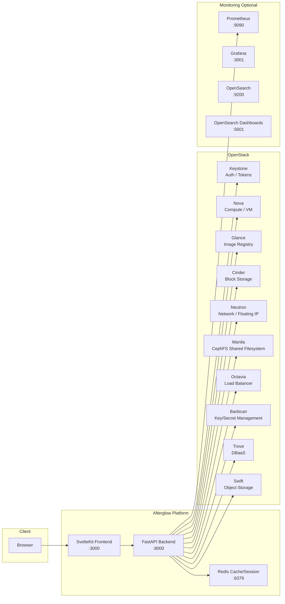
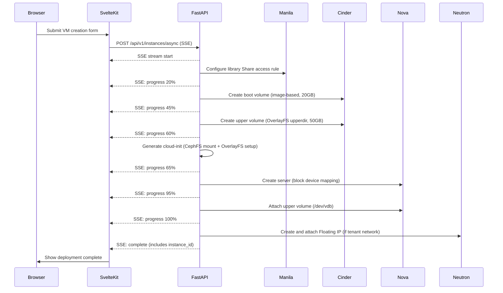
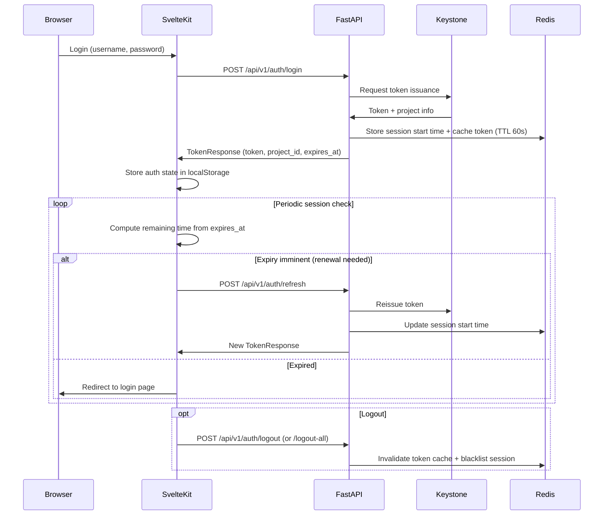
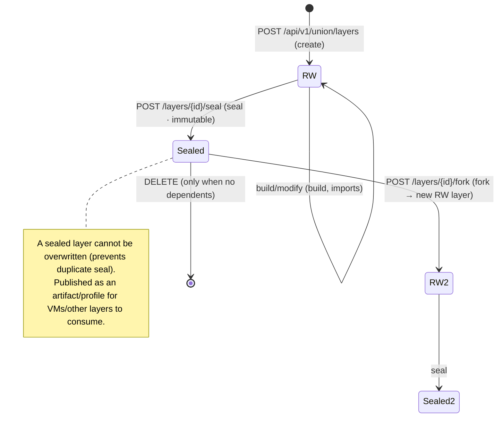
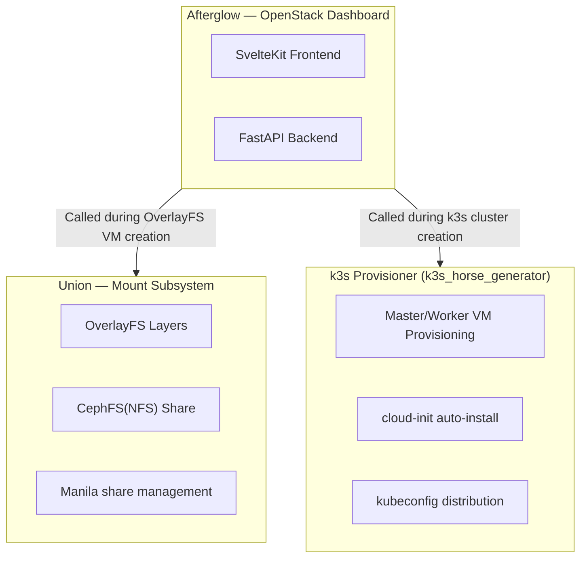

# Afterglow Architecture

## 1. System Architecture



The FastAPI backend acts as a single gateway that communicates with every OpenStack service. The browser communicates with the backend only through SvelteKit and never accesses the OpenStack API directly. Redis provides short-term caching of OpenStack API responses and stores session start times.

> **API Versioning Rule (2026-06-18~)**: All routers are mounted solely under `/api/v1`. Every path in this documentation is based on `/api/v1/...`. The only exceptions are the three legacy endpoints baked into cloud-init (`POST /api/k3s/callback`,
> `POST /api/instances/{id}/health/report`, `POST /api/instances/{id}/credentials/rotate-cephx`), which are dual-mounted on both
> `/api` and `/api/v1`.

> **Subsystems**: In addition to the OpenStack core services, Afterglow embeds a **Union layer system** (OverlayFS + CephFS shared
> library), a **k3s provisioner** (lightweight Kubernetes), **monitoring integration** (Prometheus/Grafana),
> **key management** (Barbican), and **VPNaaS**. For details on each API domain, see the [API Reference](api-reference.md).

The CI/CD pipeline is wired as GitHub Actions → GHCR (container registry) → ArgoCD → Kubernetes. On a push to the `dev` branch, images are built and pushed automatically; Image Updater updates the Helm Application image values, and ArgoCD syncs the `helm/afterglow` chart.

---

## 2. CI/CD Pipeline (ArgoCD GitOps)

On a push to the `dev` branch, the GitHub Actions workflow runs in the following order.

```
push to dev
  → [Docker Build & Push]
      → build backend/frontend/worker images (linux/amd64 + linux/arm64)
      → push to GHCR with :dev tag
  → Image Updater updates the afterglow-dev Helm Application image digest
  → ArgoCD detects the helm/afterglow chart diff
  → afterglow-dev Application auto-sync
  → rolling update with the new digest
```

On a push of a `v*` tag, images are built with the `:vX.Y.Z` + `:latest` tags.

---

## 3. VM Creation Flow

During VM creation, Afterglow streams real-time progress via SSE (Server-Sent Events). The `POST /api/v1/instances/async` endpoint handles this.



### Rollback on Failure

If an error occurs at any step during creation, the resources already created are deleted in reverse order.

| Order | Rollback Target |
|------|-----------|
| 1 | Delete Floating IP |
| 2 | Delete Nova server |
| 3 | Delete boot volume / upper volume |
| 4 | Revoke Manila access rule |
| 5 | Delete dynamic share |

### Library Strategies

| Strategy | Description |
|------|------|
| `prebuilt` | Adds an access rule to a read-only CephFS share pre-built by an administrator. Fast and storage-efficient. |
| `dynamic` | Creates a new VM-dedicated read-write CephFS share. Fully isolated but takes longer to create. |

---

## 4. Authentication and Session Management

Afterglow stores the Keystone token in the browser's localStorage and records the session start time in Redis, implementing a separate app-level session timeout.



### Authentication Headers

Every API request that requires authentication must include the following headers.

```
Authorization: Bearer <access_jwt>
X-Project-Id: <project-uuid>
```

### Cache Pre-warming After Login

Immediately after a successful login, a background task pre-populates dashboard-related caches (server list, compute limits, storage limits, flavor list) to improve first-screen loading speed.

---

## 5. OverlayFS Architecture

A core feature of Afterglow is using a CephFS library share as the OverlayFS read-only lower layer.

```
VM internal filesystem view
─────────────────────────────────────────────────────
/workspace           ← OverlayFS unified mount point
  (merged view)
      │
      ├── lowerdir   ← Manila CephFS share (read-only)
      │              │  Pre-built libraries, Python env,
      │              │  conda env, CUDA runtime, etc.
      │              │  Multiple libraries stacked
      │
      └── upperdir   ← Cinder volume /dev/vdb (read/write)
                     │  User working files, code, outputs
                     │  Can be preserved as a volume even after VM deletion
```

### Layer Details

| Layer | Storage | Access | Contents |
|--------|---------|-----------|------|
| lowerdir (lower) | Manila CephFS share | read-only | Python/conda environments, shared libraries, CUDA runtime |
| upperdir (upper) | Cinder volume 50GB | read/write | User data, working files, additional pip packages |
| merged | OverlayFS virtual layer | read/write | Unified view visible to the user |

### Advantages

- **Storage savings**: Multiple VMs share the same library share. Library data is not duplicated once per VM.
- **Fast provisioning**: There is no process of installing libraries inside the VM. cloud-init only performs the CephFS mount and OverlayFS setup.
- **Isolation**: Each VM's writes are recorded only to its dedicated Cinder volume (upperdir), so they do not affect other VMs.
- **Data preservation**: Even if the VM is deleted, user work can be retained by preserving the upper volume separately.

### Union Layer Lifecycle (seal / fork / build)

> ⚠️ **The `/api/v1/union/...` endpoints in this section were removed on 2026-07-27.** The diagram below
> records the second-generation union design, whose infrastructure was never deployed. The current layer
> domain is [Palimpsest](palimpsest.md), and the actual build/consume pipeline is the
> [squashfs layer pipeline](squashfs-layer-pipeline.md). The content-addressable, single-parent, and
> immutability **principles carry over to Palimpsest** (identity is the sha256 of the `.sqsh` blob).

The Union layer system follows the principles of **content-addressable**, **single-parent inheritance**, and **seal immutability (3-lock)**.
A layer starts in the RW (writable) state, becomes immutable once **sealed**, and only a sealed layer can be
**forked** to create a new RW layer. For the detailed API, see the [Union Layer API](api/union.md).



Artifacts of a sealed layer are published by an administrator as a **profile**, and users consume them via `POST /api/v1/union/consume`
to mount them as the library lowerdir during VM creation. snapshot/restore is integrated with Manila snapshots.

---

## 6. Multi-Subproject Structure

This repository gathers three subprojects into a single monorepo.



| Subproject | Name | Role |
|---|---|---|
| Dashboard | **Afterglow** | OpenStack resource management UI and API gateway |
| Mount Subsystem | **Union** | Shared-library VM environment based on OverlayFS + CephFS(NFS) + Manila. This name is the actual name of the feature and does not change. |
| k3s Provisioner | **k3s_horse_generator** (tentative) | Lightweight Kubernetes provisioning that installs k3s directly on VMs without Magnum. Final name not yet decided. |

### Distinction in Code

Each subproject uses an independent namespace so that identifiers do not overlap.

| Subproject | Internal Identifier Examples |
|---|---|
| Afterglow | `conn._afterglow_token`, `AFTERGLOW_TEST_*` env vars |
| Union | `union_type`, `union_library`, `union-upper-*` resource prefix |
| k3s Provisioner | `k3s_horse_generator_role`, `k3s_horse_generator_cluster_id` Nova metadata |

---

## 7. Monitoring Architecture


*Unified monitoring page — view real-time CPU, memory, network, and disk I/O of a VM selected from the full instance list, by 1-hour/6-hour/24-hour intervals*

### Grafana Embed

The `GET /api/v1/grafana/dashboards` endpoint returns the Grafana base URL (`grafana_url`) and the dashboard UID mapping (node,
libvirt, openstack, ceph, instance-cpu/gpu, etc.). The frontend combines this information to embed Grafana dashboards
in an `<iframe>`. If `grafana_url` is unset, an empty string is returned, and the frontend handles this as an empty state.

### Prometheus HTTP SD

The `GET /api/v1/sd/prometheus/targets` endpoint returns VM targets in the Prometheus http_sd_config format.
(`GET /api/v1/sd/prometheus/libvirt-targets` returns libvirt exporter targets.)

```json
[
  {
    "targets": ["10.0.0.5:9100"],
    "labels": {
      "instance": "my-vm",
      "project_id": "abc123",
      "flavor": "m1.small",
      "gpu": "false"
    }
  }
]
```

- GPU VMs get an additional `:9400` (dcgm_exporter) target.
- Authentication accepts only the `Authorization: Bearer <monitoring_sd_token>` header.

### Monitoring SG Automation

When a new project is created, `ensure_monitoring_ingress_sg()` automatically creates a monitoring-dedicated security group for that project, and it is automatically attached to VMs on subsequent VM creation.

---

## 8. K3s Cluster Provisioning

Afterglow's k3s provisioner deploys k3s on top of OpenStack VMs to provide Kubernetes clusters. It works with only Nova + cloud-init, without Magnum.

### Cluster Creation Flow

```
Client → POST /api/v1/k3s/clusters/async (SSE)
  → Create security group
  → Create boot volume (Cinder)
  → Aggregate plugin registry (cloud.conf + manifests + server args)
  → Create server VM (cloud-init: install k3s + kubectl apply)
  → Server VM sends kubeconfig + node_token to /api/k3s/callback
      (baked legacy path — dual-mounted on both /api and /api/v1, consumes a one-time callback token instead of authentication)
  → Create agent VMs (cloud-init: k3s-agent join)
  → Cluster ACTIVE
```

### Cloud Provider OpenStack Plugins

The `backend/app/services/k3s_plugins/` package manages the plugin registry. Each plugin is enabled independently in the `afterglow.conf [k3s]` section.

| Plugin | Config Key | Deployed Resources | Purpose |
|---------|--------|-----------|------|
| **OCCM** | `occm_enabled` | DaemonSet + RBAC | Node initialization, Service LB (Octavia) |
| **Cinder CSI** | `cinder_csi_enabled` | StatefulSet + DaemonSet + CSIDriver | PVC → Cinder block storage |
| **Manila CSI** | `manila_csi_enabled` | StatefulSet + DaemonSet + NFS CSI | PVC → Manila NFS (ReadWriteMany) |
| **Octavia Ingress** | `octavia_ingress_enabled` | StatefulSet + IngressClass | Ingress → Octavia LB |
| **Keystone Auth** | `keystone_auth_enabled` | Deployment + Service (8443) | K8s auth → Keystone token |
| **Barbican KMS** | `barbican_kms_enabled` | DaemonSet (control plane) | K8s Secret at-rest encryption |

#### Plugin Deployment Mechanism

```
registry.aggregate_cloud_conf()  →  /etc/kubernetes/cloud.conf  (OCCM + Cinder shared Secret)
registry.aggregate_manifests()   →  /opt/k3s/{plugin}-manifests.yaml
registry.aggregate_server_args() →  K3s install args (--kube-apiserver-arg, etc.)

Plugin deployment loop in callback.sh:
  kubectl create secret ... cloud-config  # once when cloud.conf is present
  for plugin in active_plugins:
    kubectl apply -f /opt/k3s/{plugin}-manifests.yaml
  → reports plugin_status: {plugin: "deployed"|"failed"} to /api/k3s/callback
```

#### K3s Node Naming Convention

| VM Role | K8s Node Name |
|--------|-------------|
| Server (control plane) | `{cluster_name}-server` |
| Agent #1 | `{cluster_name}-agent-1` |
| Agent #2 | `{cluster_name}-agent-2` |

On scale-down or cluster deletion, `k3s_kube.delete_k8s_nodes()` removes the K8s node objects before deleting the VMs, preventing OCCM's `failed to find object` infinite retry.

---

## Security Model Summary

For the full security model, see [docs/security.md](../security.md), and for per-version changes, see the [CHANGELOG](../../CHANGELOG.md) / [docs/releases/](../releases/).

### Authentication Flow

```
[Browser] ──Authorization: Bearer <jwt> (+X-Project-Id)──▶ [FastAPI]
                                              │
                                              ├─ Redis token cache (TTL 60s, invalidate on logout)
                                              │   └ miss → Keystone re-validation
                                              │
                                              ├─ create project-scoped Connection
                                              │   store conn._afterglow_project_id
                                              │
                                              ├─ assert_resource_owner (defense-in-depth)
                                              │   - admin token bypass
                                              │   - external/shared resource exemption
                                              │   - 404 on mismatch (prevents enumeration)
                                              │
                                              └─ activity_recorder.rec(...)
                                                  audit_log row + source_ip
```

### Core Guardrails (1.14.0)

| Area | Guard |
|---|---|
| Cross-tenant access | `assert_resource_owner` is applied consistently to mutations/details of Network/LB/Trove/Cinder/Manila/Compute. Blocked at the backend even if the OpenStack policy is broad |
| K3s secrets | HKDF-SHA256 sub-key domain separation (kubeconfig / node_token / manager_password / notion). Cross-decrypt across domains is impossible even if a single master key leaks |
| Kubeconfig download | audit_log + source IP on every GET. Enables forensics of token theft |
| K3s callback | Extracts source IP via `_get_real_ip` (trusted_proxies validation) + warns on mismatch with body.server_ip |
| Health Bearer token | 7-day absolute expiry (sliding TTL removed). Even if exposed in VM userdata, cephx rotate permission is invalidated after 7 days |
| Cloud-init templates | Explicit Jinja2 `autoescape=False` + `shlex_quote` applied to all user input |
| Production boot | `AFTERGLOW_ENV=production` + `AFTERGLOW_ALLOW_INSECURE=1` or default secret_key → ValueError |
| Rate limiting | `_get_real_ip` validates the `trusted_proxies` CIDR — ignores X-Forwarded-For on direct external requests |

### Exemptions (intentional)

- **External networks** (`is_router_external=True`) / **shared networks** (`is_shared=True`) — cross-project exposure is normal
- **Public shares** (`is_public=True`) — the same applies to Manila shares
- **Object storage** — no backend validation since the Swift account model is the first line of defense (only attaches owner metadata to new containers, as a basis for operational tooling)
- **admin token** (`token_info.is_system_admin=True`) — bypasses all owner checks
